# Graph Theory Fundamentals

Network Analysis - Lecture 2
Nikola Balic, Faculty of Natural Science, University of Split
Data Science and Engineering Master Program

---

## Overview

- Basic graph concepts and terminology
- Types of graphs
- Graph representations
- Graph properties
- Basic graph algorithms
- Applications in network analysis

---

## Constructing a Graph

A graph is built by adding nodes and edges:

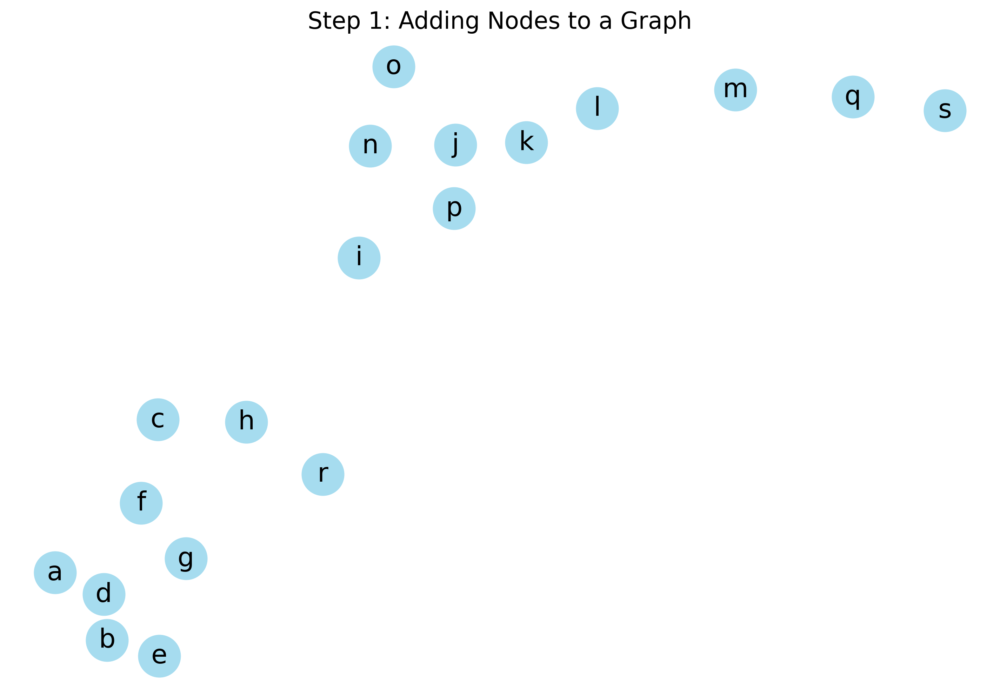

First, we define the set of nodes (vertices) in our graph.

---

## Our Example Network

Throughout this lecture, we'll use this network to illustrate graph theory concepts:

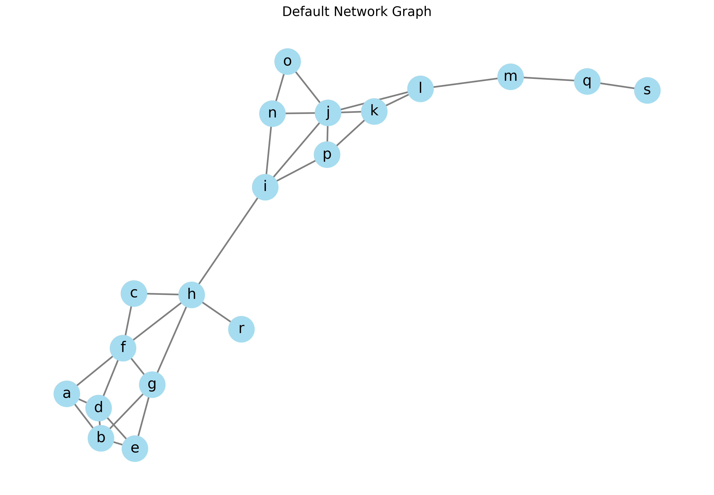

This network has 19 nodes (a-s) and 31 edges, with two main clusters connected by node h.

---

## Task: Recreate the Example Network

Try to recreate this network in Google Colab:

1. Create a new Colab notebook
2. Install and import NetworkX
3. Add all 19 nodes (a-s)
4. Add the 31 edges based on the visualization
5. Visualize your graph and compare with the example

This exercise will help you practice basic graph construction in NetworkX.

---

## NetworkX Essentials

Here's how to create a graph using NetworkX:

```python
# Import necessary libraries
import networkx as nx
import matplotlib.pyplot as plt

# Create an empty graph
G = nx.Graph()
```

---

## Constructing a Graph (cont.)

Then we add edges to connect the nodes:

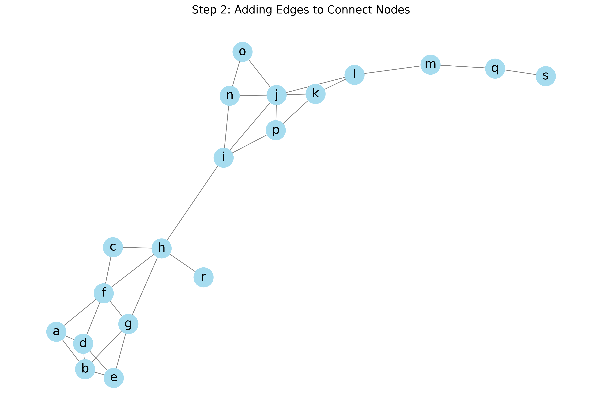

The edges represent relationships or connections between nodes.


---

## NetworkX Essentials contd.

```python
# Add nodes
G.add_nodes_from(['a', 'b', 'c', 'd', 'e', 'f', 'g', 'h'])

# Add edges
edges = [('a', 'b'), ('a', 'c'), ('b', 'd'), ('c', 'e'),
         ('d', 'f'), ('e', 'f'), ('f', 'g'), ('g', 'h')]
G.add_edges_from(edges)
```

---

## NetworkX Essentials contd.

```python
# Visualize the graph
plt.figure(figsize=(10, 8))
nx.draw(G, with_labels=True, node_color='lightblue',
        node_size=500, font_size=15, font_weight='bold')
plt.show()
```

---


---

## Basic Concepts

- **Graph**: A mathematical structure consisting of vertices (nodes) and edges
- **Vertex/Node**: Fundamental unit of a graph
- **Edge**: Connection between two vertices
- **Degree**: Number of edges connected to a vertex
- **Path**: Sequence of vertices connected by edges
- **Cycle**: Path that starts and ends at the same vertex

---

## Vertex Degree

The degree of a vertex is the number of edges connected to it. In this example, node j has degree 6 (connections to i, k, l, n, o, and p).

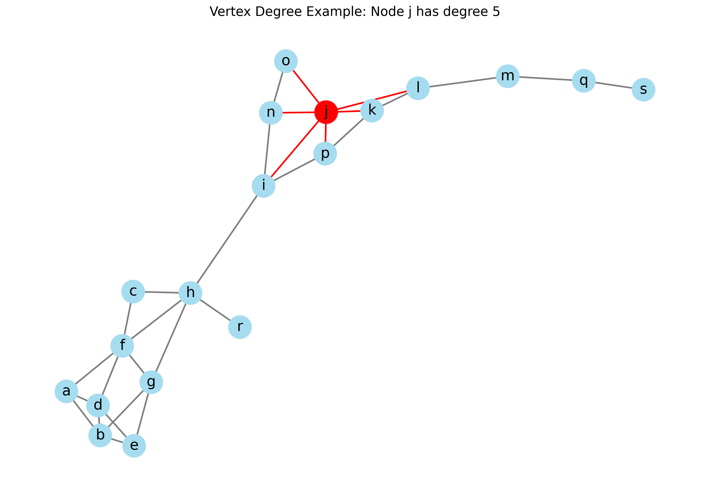

---

## Path

A path is a sequence of vertices connected by edges. This shows a path from node a to node m: a → f → h → i → j → l → m

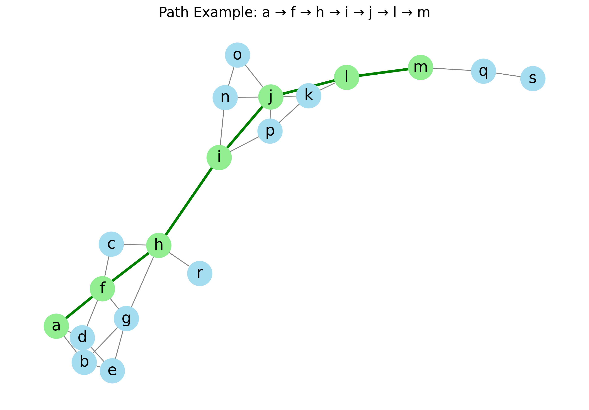

---

## Cycle

A cycle is a path that starts and ends at the same vertex:

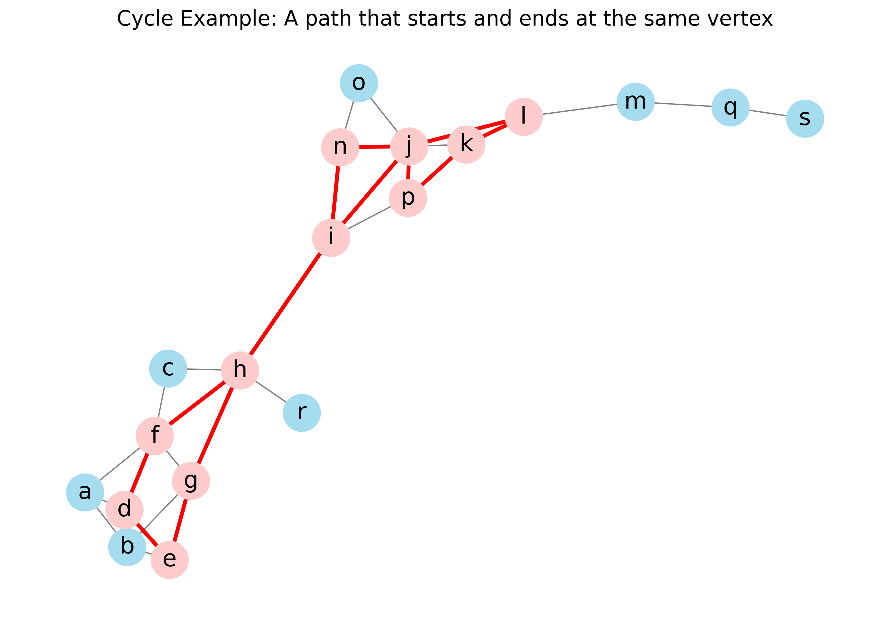

This example shows a cycle that passes through multiple nodes and returns to the starting point.

---

## Types of Graphs

- **Undirected vs. Directed**
  - Undirected: Edges have no direction
  - Directed (Digraph): Edges have direction

- **Weighted vs. Unweighted**
  - Weighted: Edges have associated values
  - Unweighted: All edges are equal

---

## Undirected Graph

In an undirected graph, edges have no direction - the connection between nodes is bidirectional:

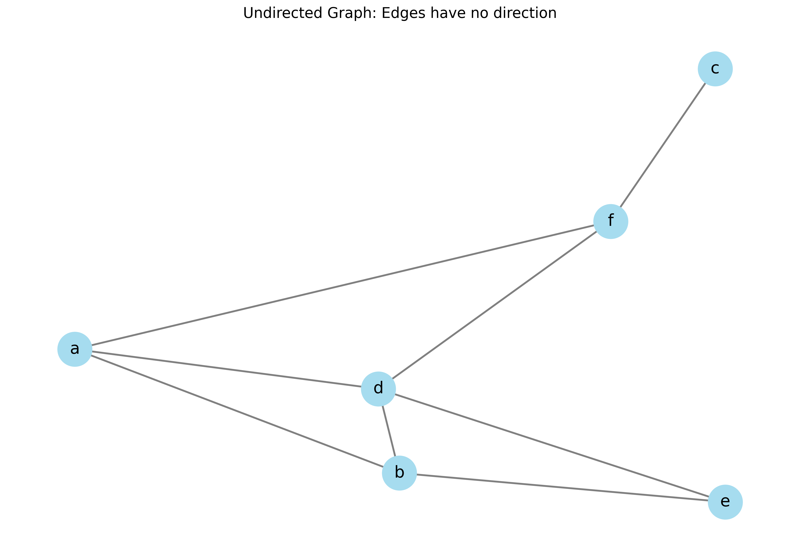

If node a is connected to node b, then node b is also connected to node a.

---

## Directed Graph

In a directed graph, edges have direction - they go from one node to another:

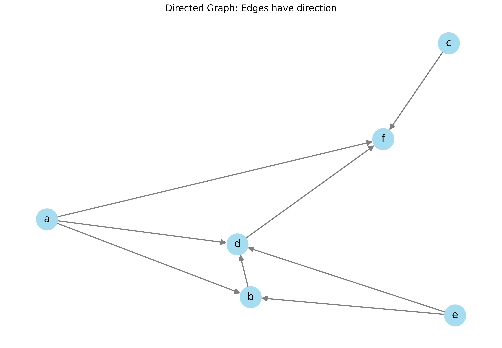

The arrows indicate the direction of the relationship. For example, a → b does not imply b → a.

---

## Weighted Graph

In a weighted graph, edges have associated values (weights):

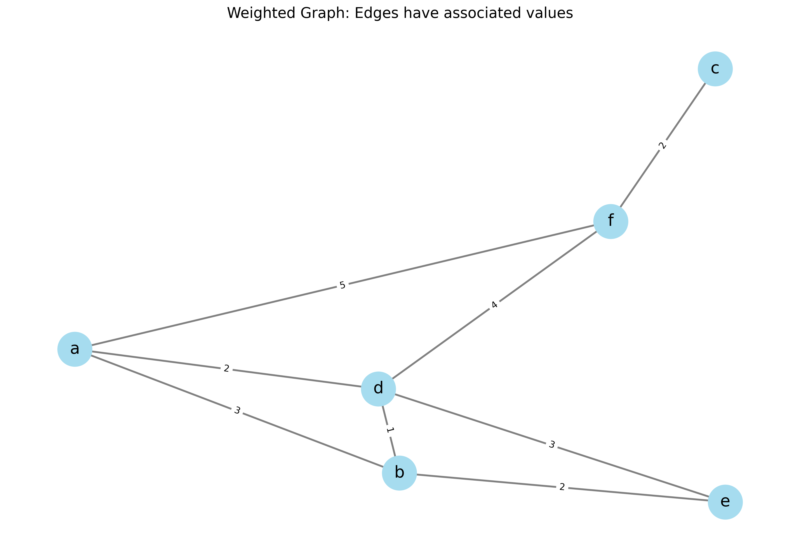

Weights can represent distance, cost, capacity, or any other quantitative relationship.

---

## More Graph Types

- **Simple Graph**: No self-loops or multiple edges
- **Multigraph**: Allows multiple edges between vertices
- **Complete Graph**: Every vertex is connected to every other vertex
- **Bipartite Graph**: Vertices can be divided into two disjoint sets
- **Tree**: Connected graph with no cycles
- **Planar Graph**: Can be drawn on a plane without edge crossings

---
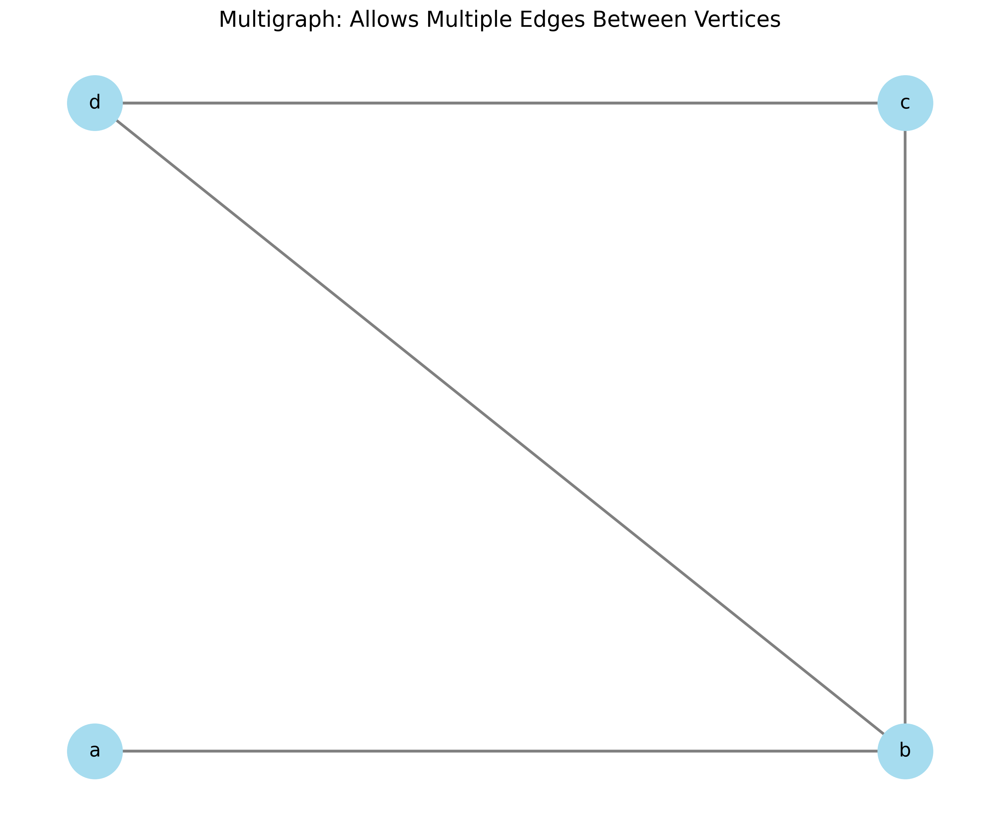

## Multigraph

A multigraph allows multiple edges between the same pair of vertices.

Notice the multiple edges between nodes a-b and c-d. These could represent different types of relationships.

---

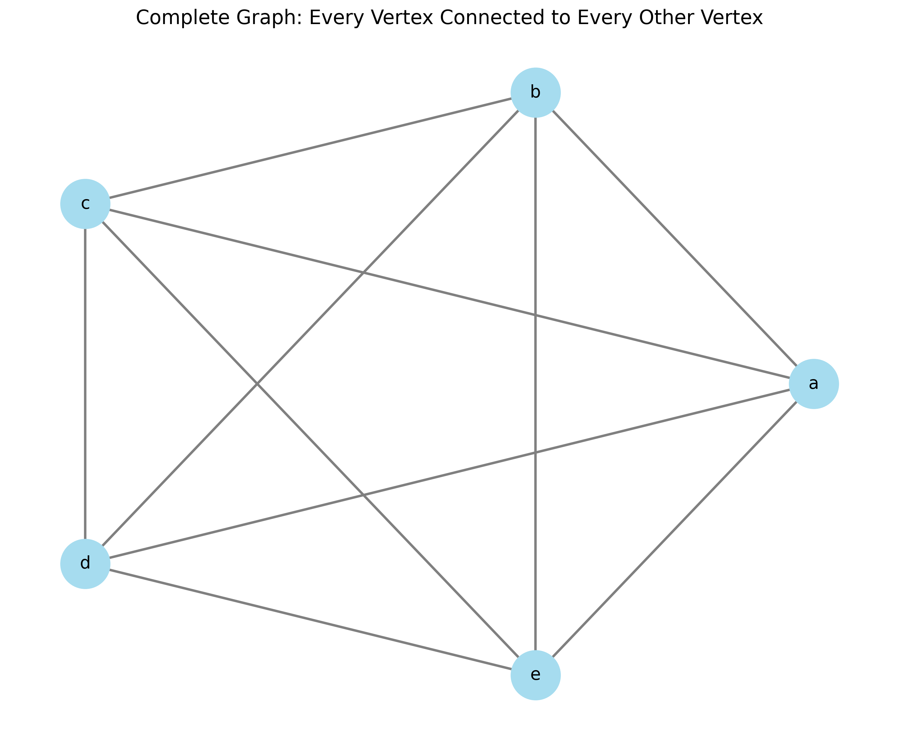

## Complete Graph

In a complete graph, every vertex is connected to every other vertex.

A complete graph with n vertices has n(n-1)/2 edges. This example has 5 vertices and 10 edges.

---

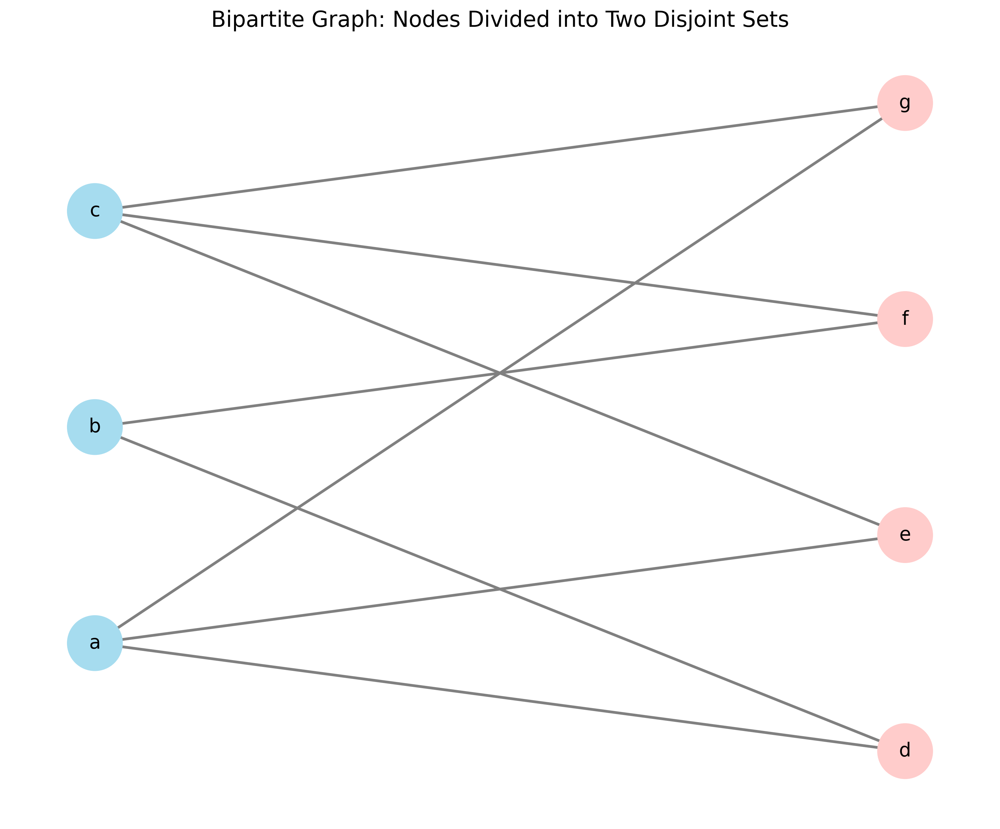

## Bipartite Graph

In a bipartite graph, vertices can be divided into two disjoint sets with edges only between sets.

Blue nodes (a, b, c) form one set, and red nodes (d, e, f, g) form the other set. No edges exist within the same set.

---

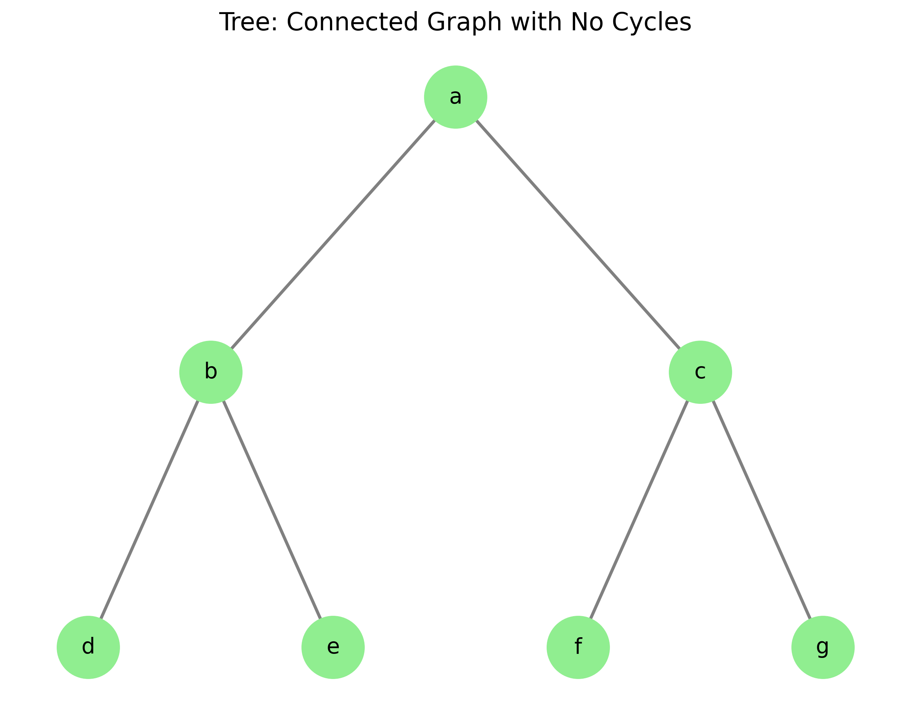

## Tree

A tree is a connected graph with no cycles.

Trees have exactly n-1 edges for n vertices. They're used for hierarchical relationships like file systems.

---

## Planar Graph

A planar graph can be drawn on a plane without edge crossings:

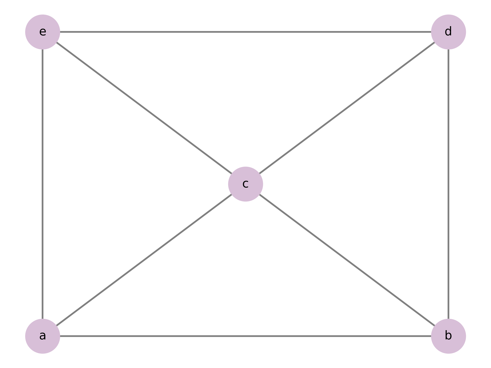

This property is important in circuit design and map coloring problems.

---

## Graph Representations

### Adjacency Matrix

- An n×n matrix where n is the number of vertices
- Entry a_ij = 1 if there is an edge from vertex i to vertex j, otherwise 0
- For weighted graphs, a_ij = weight of the edge

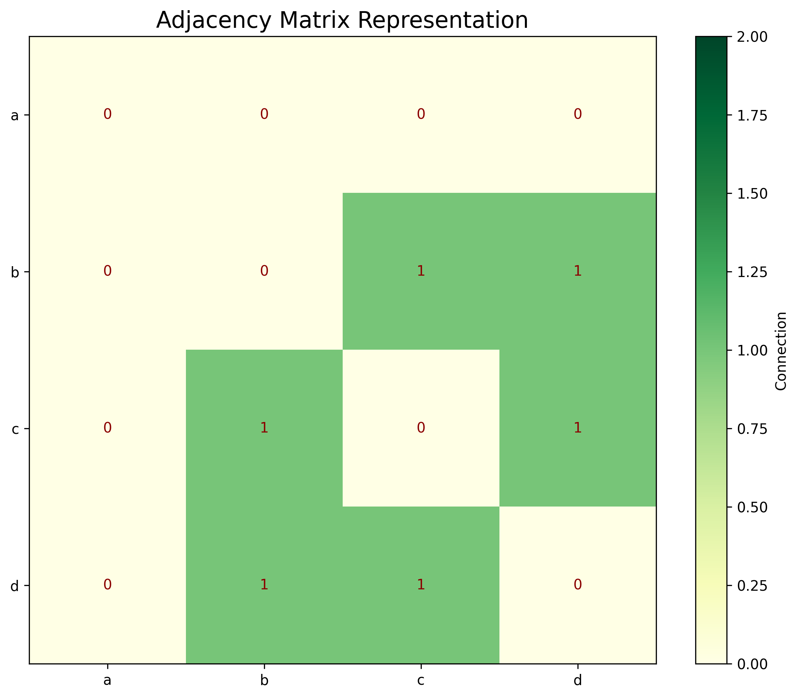

---

## Graph Representations (cont.)

### Adjacency List
- For each vertex, maintain a list of its adjacent vertices
- More space-efficient for sparse graphs

```
a: [b, d, f]
b: [a, d, e, g]
c: [f, h]
d: [a, b, e, f]
...
```

---

## Graph Properties

- **Connectivity**: A graph is connected if there is a path between every pair of vertices
- **Component**: Maximal connected subgraph
- **Density**: Ratio of actual edges to potential edges
- **Diameter**: Maximum shortest path length between any two vertices
- **Clustering Coefficient**: Measure of the degree to which nodes tend to cluster together

---

## Connected Components

When a graph is disconnected, it consists of multiple connected components:

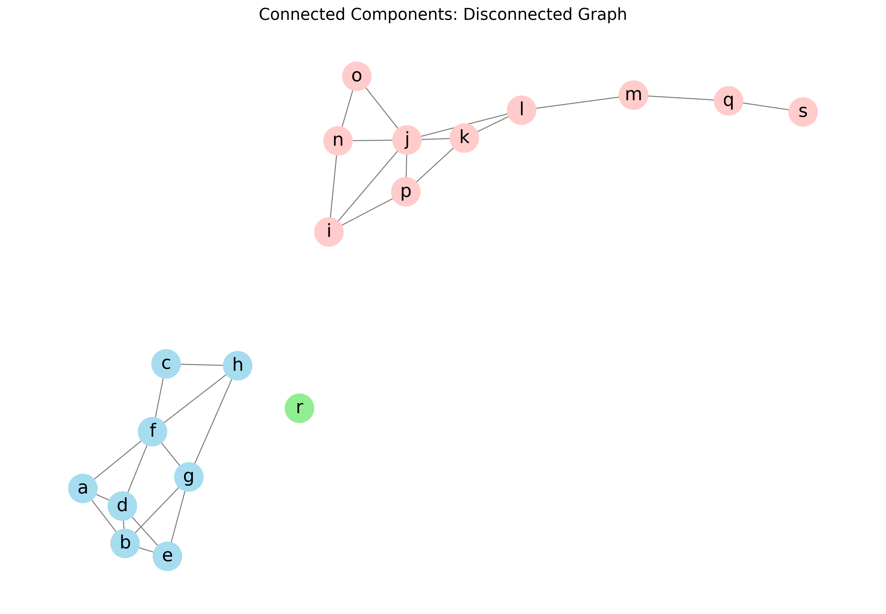

In this example, removing the bridges between clusters creates separate components (shown in different colors).

---

## Basic Graph Algorithms

- **Breadth-First Search (BFS)**
  - Explores all neighbors at the present depth before moving to vertices at the next depth level
  - Used for finding shortest paths in unweighted graphs

- **Depth-First Search (DFS)**
  - Explores as far as possible along each branch before backtracking
  - Used for topological sorting, detecting cycles

---

## More Algorithms

- **Dijkstra's Algorithm**: Finding shortest paths in weighted graphs
- **Minimum Spanning Tree**: Kruskal's and Prim's algorithms
- **PageRank**: Ranking vertices by importance
- **Community Detection**: Finding groups of densely connected vertices

---

## Applications in Network Analysis

- **Social Networks**: Identifying influential individuals, communities
- **Transportation Networks**: Optimizing routes, analyzing traffic flow
- **Biological Networks**: Protein interactions, metabolic pathways
- **Information Networks**: Web page ranking, recommendation systems
- **Infrastructure Networks**: Power grids, communication networks

---

## Graph Theory in Python with NetworkX

```python
import networkx as nx
import matplotlib.pyplot as plt

# Create a graph
G = nx.Graph()

# Add nodes and edges
nodes = ['a', 'b', 'c', 'd', 'e', 'f', 'g', 'h']
G.add_nodes_from(nodes)
edges = [('a', 'b'), ('a', 'f'), ('b', 'd'), ('c', 'f'),
         ('d', 'f'), ('e', 'g'), ('f', 'g'), ('g', 'h')]
G.add_edges_from(edges)

# Visualize
nx.draw(G, with_labels=True)
plt.show()
```

---

## Key Takeaways

- Graph theory provides the mathematical foundation for network analysis
- Different graph types model different real-world scenarios
- Graph representations affect computational efficiency
- Graph algorithms solve practical network problems
- Understanding graph properties helps analyze complex networks

---

## Next Lecture

Network Measures and Metrics: Quantifying network characteristics
