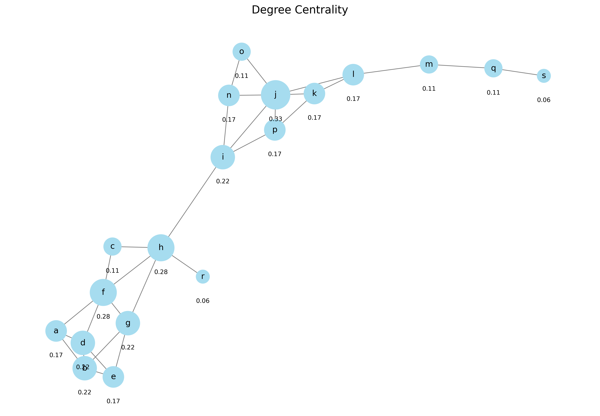
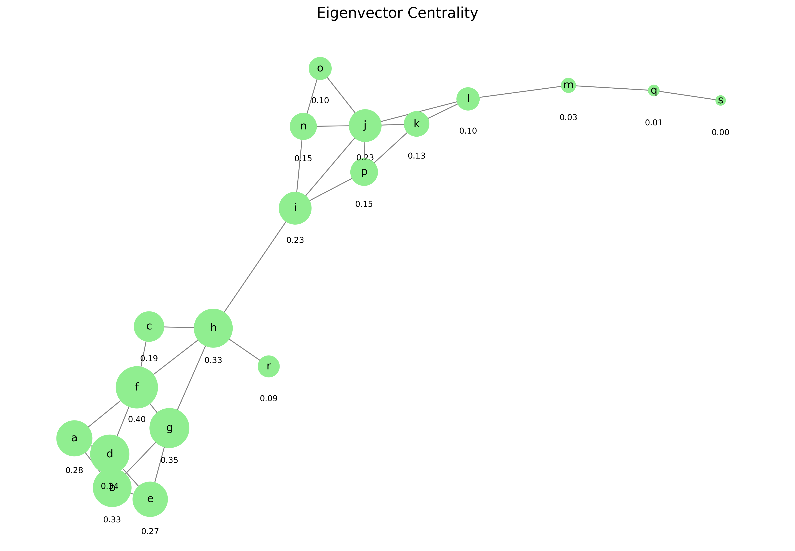
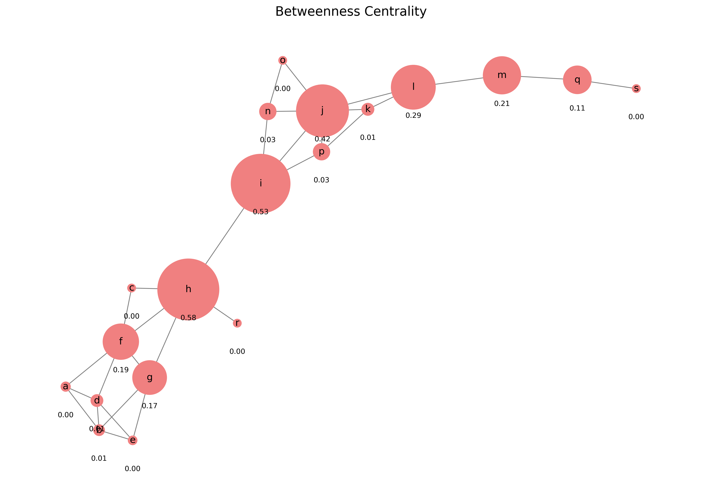

# Network Measures and Metrics

Network Analysis - Lecture 3
Nikola Balic, Faculty of Natural Science, University of Split
Data Science and Engineering Master Program

---

## Overview

- Centrality measures
- Path-based metrics
- Structural metrics
- Connectivity measures
- Subgraph metrics
- Practical applications

---

## Centrality Measures

Centrality measures identify the most important vertices within a graph.

- **Degree Centrality**: Number of connections a node has
- **Eigenvector Centrality**: Node importance based on connection to other important nodes
- **Betweenness Centrality**: Frequency of a node appearing on shortest paths
- **Closeness Centrality**: Average shortest path length to all other nodes

---

## Degree Centrality

- Simplest centrality measure
- Defined as the number of links incident upon a node
- For directed networks:
  - **In-degree**: Number of incoming edges
  - **Out-degree**: Number of outgoing edges
- Normalized degree: $C_D(v) = \frac{deg(v)}{n-1}$ where n is the number of nodes

---

## Example: Degree Centrality



In our default graph:
- Node 'j' has the highest degree centrality (0.33, 5 connections)
- Nodes 'h' and 'f' also have high degree centrality (0.28, 4 connections each)
- Peripheral nodes like 's', 'r', 'c' have low degree centrality (0.06-0.11, 1-2 connections)
- *Note: The value below each node shows its normalized degree centrality*

---

## Eigenvector Centrality

- Measures influence of a node in a network
- A node is important if it's connected to other important nodes
- Used in Google's PageRank algorithm
- Mathematically: $x_v = \frac{1}{\lambda} \sum_{t \in N(v)} x_t$
  - Where λ is a constant and N(v) is the set of neighbors of v

---

## Example: Eigenvector Centrality



In our default graph:
- Node 'f' has the highest eigenvector centrality (0.40) despite not having the most connections
- Nodes 'g', 'd', 'h', and 'b' also have high eigenvector centrality (0.33-0.35)
- Node 'j' has moderate eigenvector centrality (0.23) despite high degree
- *Note: The value below each node shows its eigenvector centrality score*

---

## Betweenness Centrality

- Measures the extent to which a node lies on paths between other nodes
- Nodes with high betweenness control information flow in the network
- Formula: $C_B(v) = \sum_{s \neq v \neq t} \frac{\sigma_{st}(v)}{\sigma_{st}}$
  - Where σ_st is the total number of shortest paths from node s to node t
  - σ_st(v) is the number of those paths that pass through v

---

## Example: Betweenness Centrality



In our default graph:
- Node 'h' has the highest betweenness centrality (0.58) as it bridges the two main clusters
- Node 'i' also has high betweenness (0.53) as it's a gateway to the bottom cluster
- Node 'j' has significant betweenness (0.42) despite being in a single cluster
- *Note: The value below each node shows its betweenness centrality score*

---

## Closeness Centrality

- Measures how close a node is to all other nodes in the network
- Calculated as the reciprocal of the sum of the shortest path distances
- Formula: $C_C(v) = \frac{n-1}{\sum_{u \neq v} d(u,v)}$
  - Where d(u,v) is the shortest path distance between u and v
  - n is the number of nodes in the graph

---

## Example: Closeness Centrality


In our default graph:
- Nodes 'i' and 'h' have the highest closeness centrality (0.43 and 0.42)
- Node 'j' also has high closeness (0.40) due to its central position in the bottom cluster
- Peripheral nodes like 's' and 'q' have the lowest closeness (0.18 and 0.22)
- *Note: The value below each node shows its closeness centrality score*

---

## Path-Based Metrics

- **Average Path Length**: Average number of steps along the shortest paths for all possible pairs of nodes
- **Diameter**: Maximum shortest path length between any pair of nodes
- **Eccentricity**: Maximum distance from a node to any other node
- **Radius**: Minimum eccentricity in the graph

---

## Structural Metrics

- **Density**: Ratio of actual connections to potential connections
  - $D = \frac{2|E|}{|V|(|V|-1)}$ for undirected graphs
  - $D = \frac{|E|}{|V|(|V|-1)}$ for directed graphs
- **Transitivity**: Probability that adjacent vertices of a vertex are connected
- **Reciprocity**: Proportion of mutual connections in directed networks

---

## Clustering Coefficient

- Measures the degree to which nodes tend to cluster together
- **Local clustering coefficient**: For a node v, the proportion of links between its neighbors divided by the number of links that could possibly exist
- **Global clustering coefficient**: Average of local clustering coefficients of all nodes
- **Transitivity**: Ratio of triangles to connected triples in the network

---

## Connectivity Measures

- **Node Connectivity**: Minimum number of nodes that must be removed to disconnect the graph
- **Edge Connectivity**: Minimum number of edges that must be removed to disconnect the graph
- **K-Core**: Maximal subgraph where each vertex has at least degree k
- **Articulation Points**: Nodes that, when removed, increase the number of connected components

---

## Subgraph Metrics

- **Cliques**: Complete subgraphs where every node is connected to every other node
- **Motifs**: Small patterns of interconnections occurring significantly more often than in random networks
- **Graphlets**: Small, connected, non-isomorphic induced subgraphs
- **Community Structure**: Groups of nodes with dense connections internally and sparser connections between groups

---

## Practical Applications

- **Social Networks**: Identifying influencers (high centrality)
- **Transportation Networks**: Finding critical junctions (high betweenness)
- **Biological Networks**: Identifying essential proteins (high degree/betweenness)
- **Communication Networks**: Optimizing information flow (path length analysis)
- **Recommendation Systems**: Finding similar users/items (clustering)

---

## Calculating Metrics with NetworkX

```python
import networkx as nx

# Create a graph
G = nx.karate_club_graph()

# Calculate centrality measures
degree_centrality = nx.degree_centrality(G)
betweenness_centrality = nx.betweenness_centrality(G)
closeness_centrality = nx.closeness_centrality(G)
eigenvector_centrality = nx.eigenvector_centrality(G)

# Calculate structural metrics
avg_clustering = nx.average_clustering(G)
transitivity = nx.transitivity(G)
density = nx.density(G)

# Calculate path-based metrics
avg_path_length = nx.average_shortest_path_length(G)
diameter = nx.diameter(G)
```

---

## Visualizing Network Metrics

```python
import matplotlib.pyplot as plt
import networkx as nx

G = nx.karate_club_graph()
pos = nx.spring_layout(G)

# Node size based on degree centrality
centrality = nx.degree_centrality(G)
node_sizes = [centrality[n] * 1000 for n in G]

nx.draw(G, pos, with_labels=True,
        node_size=node_sizes,
        node_color='lightblue',
        edge_color='gray')
plt.title("Karate Club Graph - Node Size by Degree Centrality")
plt.show()
```

---

## Interpreting Network Metrics

- **High Centrality**: Key players, influencers, bottlenecks
- **High Clustering**: Tight-knit communities, redundant connections
- **Low Average Path Length**: Efficient information spread
- **High Density**: Robust, well-connected network
- **Community Structure**: Functional modules, interest groups

---

## Key Takeaways

- Network metrics quantify structural properties of networks
- Different centrality measures capture different aspects of node importance
- Path-based metrics help understand network efficiency
- Structural metrics characterize overall network organization
- Metrics guide interventions in real-world networks

---

## Next Lecture

Network Visualization: Techniques for effectively visualizing complex networks