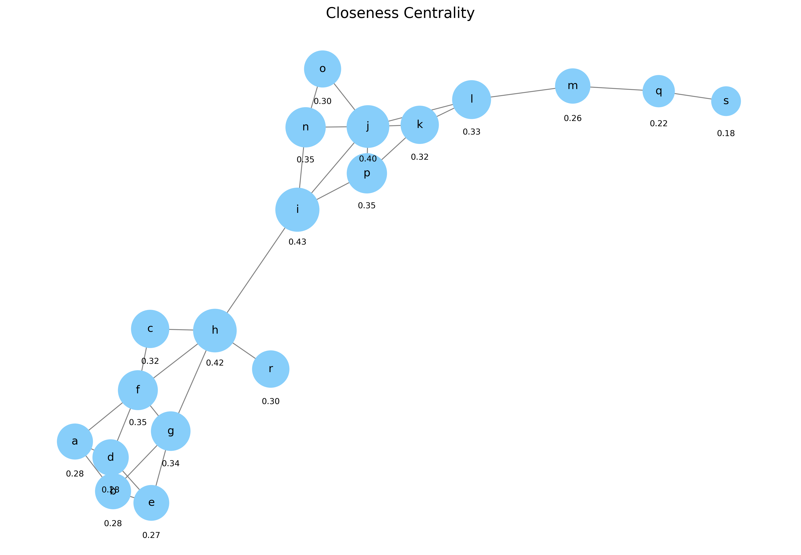

# Network Measures and Metrics

Network Analysis - Lecture 3
Nikola Balic, Faculty of Natural Science, University of Split
Data Science and Engineering Master Program

---

## Overview

- Centrality measures
- Path-based metrics
- Structural metrics
- Connectivity measures
- Subgraph metrics
- Practical applications

---

## Centrality Measures

Centrality measures identify the most important vertices within a graph.

- **Degree Centrality**: Number of connections a node has
- **Eigenvector Centrality**: Node importance based on connection to other important nodes
- **Betweenness Centrality**: Frequency of a node appearing on shortest paths
- **Closeness Centrality**: Average shortest path length to all other nodes

---

## Degree Calculation

- The **degree** of a node is the number of edges connected to it
- In network analysis, it represents the number of direct connections a node has
- For an undirected graph:
  - $deg(v) = |\{u \in V : (u,v) \in E\}|$
- For a directed graph:
  - **In-degree**: Number of incoming edges
  - **Out-degree**: Number of outgoing edges

---


---

## Degree Centrality

- Simplest centrality measure
- Defined as the number of links incident upon a node
- For directed networks:
  - **In-degree**: Number of incoming edges
  - **Out-degree**: Number of outgoing edges
- Normalized degree: $C_D(v) = \frac{deg(v)}{n-1}$ where n is the number of nodes

---

## Example: Normalized Degree Centrality


In our default graph:
- Node 'j' has the highest degree centrality (0.33, 5 connections)
- Nodes 'h' and 'f' also have high degree centrality (0.28, 4 connections each)
- Peripheral nodes like 's', 'r', 'c' have low degree centrality (0.06-0.11, 1-2 connections)
- *Note: The value below each node shows its normalized degree centrality*

---

## Eigenvector Centrality

- Measures influence of a node in a network
- A node is important if it's connected to other important nodes
- Used in Google's PageRank algorithm
- Mathematically: $x_v = \frac{1}{\lambda} \sum_{t \in N(v)} x_t$
  - Where λ is a constant and N(v) is the set of neighbors of v

---

## Example: Eigenvector Centrality


In our default graph:
- Node 'f' has the highest eigenvector centrality (0.40) despite not having the most connections
- Nodes 'g', 'd', 'h', and 'b' also have high eigenvector centrality (0.33-0.35)
- Node 'j' has moderate eigenvector centrality (0.23) despite high degree
- *Note: The value below each node shows its eigenvector centrality score*

---

## PageRank Centrality

- Extension of eigenvector centrality designed for directed networks
- Forms the foundation of Google's original web search algorithm
- Simulates a "random surfer" following links with occasional random jumps
- Mathematically: $PR(u) = \frac{1-d}{N} + d \sum_{v \in M(u)} \frac{PR(v)}{L(v)}$
  - Where d is damping factor (typically 0.85)
  - N is total number of nodes
  - M(u) is the set of nodes that link to u
  - L(v) is the number of outbound links from node v

---

## Example: PageRank Centrality


In our default graph:
- Node distribution is different from eigenvector centrality due to random jump probability
- Nodes that are linked to by highly ranked nodes receive higher PageRank
- Used extensively in web page ranking, recommendation systems, and citation analysis
- *Note: The value below each node shows its PageRank score*

---

## Betweenness Centrality

- Measures the extent to which a node lies on paths between other nodes
- Nodes with high betweenness control information flow in the network
- Formula: $C_B(v) = \sum_{s \neq v \neq t} \frac{\sigma_{st}(v)}{\sigma_{st}}$
  - Where σ_st is the total number of shortest paths from node s to node t
  - σ_st(v) is the number of those paths that pass through v

---

## Example: Betweenness Centrality


In our default graph:
- Node 'h' has the highest betweenness centrality (0.58) as it bridges the two main clusters
- Node 'i' also has high betweenness (0.53) as it's a gateway to the bottom cluster
- Node 'j' has significant betweenness (0.42) despite being in a single cluster

---

## Closeness Centrality

- Measures how close a node is to all other nodes in the network
- Calculated as the reciprocal of the sum of the shortest path distances
- Formula: $C_C(v) = \frac{n-1}{\sum_{u \neq v} d(u,v)}$
  - Where d(u,v) is the shortest path distance between u and v
  - n is the number of nodes in the graph

---

## Example: Closeness Centrality



In our default graph:
- Nodes 'i' and 'h' have the highest closeness centrality (0.43 and 0.42)
- Node 'j' also has high closeness (0.40) due to its central position in the bottom cluster
- Peripheral nodes like 's' and 'q' have the lowest closeness (0.18 and 0.22)

---

## Centrality Measures Comparison

| Deg | Val | Eigen | Val | PR | Val | Betw | Val | Close | Val |
| :--: | :--: | :--: | :--: | :--: | :--: | :--: | :--: | :--: | :--: |
| **j** | 0.3 | **f** | 0.4 | **j** | 0.1 | **h** | 0.6 | **i** | 0.4 |
| **f** | 0.3 | **g** | 0.4 | **h** | 0.1 | **i** | 0.5 | **h** | 0.4 |
| **h** | 0.3 | **d** | 0.3 | **f** | 0.1 | **j** | 0.4 | **j** | 0.4 |
| **b** | 0.2 | **h** | 0.3 | **i** | 0.1 | **l** | 0.3 | **n** | 0.4 |
| **d** | 0.2 | **b** | 0.3 | **g** | 0.1 | **m** | 0.2 | **p** | 0.4 |

- Node **h** ranks highly in most measures (effective bridge node)
- Degree and PageRank favor **j** (well-connected)
- Eigenvector centrality highlights **f** (connected to important nodes)

---

## Path-Based Metrics

- **Average Path Length**: Average number of steps along the shortest paths for all possible pairs of nodes
- **Diameter**: Maximum shortest path length between any pair of nodes
- **Eccentricity**: Maximum distance from a node to any other node
- **Radius**: Minimum eccentricity in the graph

---

## Example: Graph Diameter

- **Diameter** is the maximum shortest path length between any pair of nodes
- Corresponds to the "worst-case scenario" for information propagation
- Calculated by finding the longest shortest path between any two nodes
- Formula: $diam(G) = \max_{u,v \in V} d(u,v)$ where $d(u,v)$ is the shortest path distance

In our default graph:
- The diameter is 8 (shortest path length between nodes 'a' and 's')
- Long diameter indicates elongated network structure with sequential information flow
- Important for understanding worst-case communication delays in the network

---

## Example: Diameter Path Visualization


The complete diameter path is: a → f → h → i → j → l → m → q → s

This path represents the "longest shortest path" in the network and has important implications:
- Information must pass through at least 8 nodes to travel between the furthest points
- Nodes along this path (especially 'h', 'i', and 'j') are critical for network connectivity
- Breaking this path would significantly increase network fragmentation

---

## Example: Node Eccentricity

- **Eccentricity** of a node is the greatest distance between that node and any other node in the network.
- The **radius** is the minimum eccentricity, representing the most central nodes, while the **diameter** is the maximum eccentricity of the graph.
- In this visualization:
  - Nodes are color-coded by their eccentricity (from low to high using a yellow-to-red gradient).
  - Central nodes (with eccentricity equal to the radius) are highlighted with a green border.
  - Peripheral nodes (with eccentricity equal to the diameter) are highlighted with a blue border.

---


---

## Structural Metrics

- **Density**: Ratio of actual connections to potential connections
  - $D = \frac{2|E|}{|V|(|V|-1)}$ for undirected graphs
  - $D = \frac{|E|}{|V|(|V|-1)}$ for directed graphs
- **Transitivity**: Probability that adjacent vertices of a vertex are connected
- **Reciprocity**: Proportion of mutual connections in directed networks

---

## Example: Network Density

- **Density** measures how close a network is to a complete graph (where all nodes are connected)
- Values range from 0 (no edges) to 1 (all possible connections exist)
- For undirected graphs: $D = \frac{2|E|}{|V|(|V|-1)}$
- For directed graphs: $D = \frac{|E|}{|V|(|V|-1)}$

---


In our default graph:
- 19 nodes and 30 edges
- Maximum possible edges = 171
- Density = 0.1754 (approximately 17.5% of possible connections exist)
- Low density indicates a sparse network with selective connections

---

## Clustering Coefficient

- Measures the degree to which nodes tend to cluster together
- **Local clustering coefficient**: For a node v, the proportion of links between its neighbors divided by the number of links that could possibly exist
- **Global clustering coefficient**: Average of local clustering coefficients of all nodes
- **Transitivity**: Ratio of triangles to connected triples in the network

---

## Connectivity Measures

- **Node Connectivity**: Minimum number of nodes that must be removed to disconnect the graph
- **Edge Connectivity**: Minimum number of edges that must be removed to disconnect the graph
- **K-Core**: Maximal subgraph where each vertex has at least degree k
- **Articulation Points**: Nodes that, when removed, increase the number of connected components

---

## Subgraph Metrics

- **Cliques**: Complete subgraphs where every node is connected to every other node
- **Motifs**: Small patterns of interconnections occurring significantly more often than in random networks
- **Graphlets**: Small, connected, non-isomorphic induced subgraphs
- **Community Structure**: Groups of nodes with dense connections internally and sparser connections between groups

---

## Calculating Metrics with NetworkX

```python
G = nx.karate_club_graph()

# Calculate centrality measures
degree_centrality = nx.degree_centrality(G)
betweenness_centrality = nx.betweenness_centrality(G)
closeness_centrality = nx.closeness_centrality(G)
eigenvector_centrality = nx.eigenvector_centrality(G)

# Calculate structural metrics
avg_clustering = nx.average_clustering(G)
transitivity = nx.transitivity(G)
density = nx.density(G)

# Calculate path-based metrics
avg_path_length = nx.average_shortest_path_length(G)
diameter = nx.diameter(G)
```

---

## Visualizing Network Metrics

```python
G = nx.karate_club_graph()
pos = nx.spring_layout(G)

# Node size based on degree centrality
centrality = nx.degree_centrality(G)
node_sizes = [centrality[n] * 1000 for n in G]

nx.draw(G, pos, with_labels=True,
        node_size=node_sizes,
        node_color='lightblue',
        edge_color='gray')
plt.title("Karate Club Graph - Node Size by Degree Centrality")
plt.show()
```
---

## Interpreting Network Metrics

- **High Centrality**: Key players, influencers, bottlenecks
- **High Clustering**: Tight-knit communities, redundant connections
- **Low Average Path Length**: Efficient information spread
- **High Density**: Robust, well-connected network
- **Community Structure**: Functional modules, interest groups

---

## Practical Applications

- **Social Networks**: Identifying influencers (high centrality)
- **Transportation Networks**: Finding critical junctions (high betweenness)
- **Biological Networks**: Identifying essential proteins (high degree/betweenness)
- **Communication Networks**: Optimizing information flow (path length analysis)
- **Recommendation Systems**: Finding similar users/items (clustering)

---

## Key Takeaways

- Network metrics quantify structural properties of networks
- Different centrality measures capture different aspects of node importance
- Path-based metrics help understand network efficiency
- Structural metrics characterize overall network organization
- Metrics guide interventions in real-world networks

---

## Next Lecture

Network Visualization: Techniques for effectively visualizing complex networks

---

## Case Study: Zachary's Karate Club

- Classic social network dataset from 1977 by Wayne Zachary
- Documents social interactions between 34 members of a karate club at a US university
- The club split into two groups following a conflict between:
  - The instructor (node 0)
  - The club president/administrator (node 33)
- The network accurately predicts the actual split that occurred
- Widely used as a benchmark for community detection algorithms

---

## Zachary's Karate Club Graph


- **Nodes**: 34 club members
- **Edges**: 78 social connections between members
- **Communities**: The actual split resulted in two groups (shown by node color)
- **Key Nodes**: Node 0 (instructor) and Node 33 (administrator) had the conflict

---

## Centrality Analysis in Karate Club


- **Node Size**: Proportional to degree centrality
- **Key Insights**:
  - Nodes 0 and 33 have highest degree centrality (leaders of the two factions)
  - Nodes 2, 32, and 1 also have high centrality (lieutenants)
  - Peripheral nodes have fewer connections (casual members)

---

## Community Structure in Karate Club


- Graph shows communities detected by the Louvain algorithm
- The network naturally splits into communities that closely match the actual split
- Some nodes are boundary spanners (high betweenness centrality)
- This demonstrates how network structure reflects and predicts real social dynamics

---

## Karate Club: Applied Learning Points

- **Centrality**: Leaders (nodes 0 and 33) have highest centrality scores
- **Path Length**: Average path length is 2.4 steps - information spreads quickly
- **Clustering**: Higher clustering within each community than between them
- **Betweenness**: Nodes that connect the communities have high betweenness (2, 8, 14)
- **Practical Application**: Network metrics successfully predict the group split

