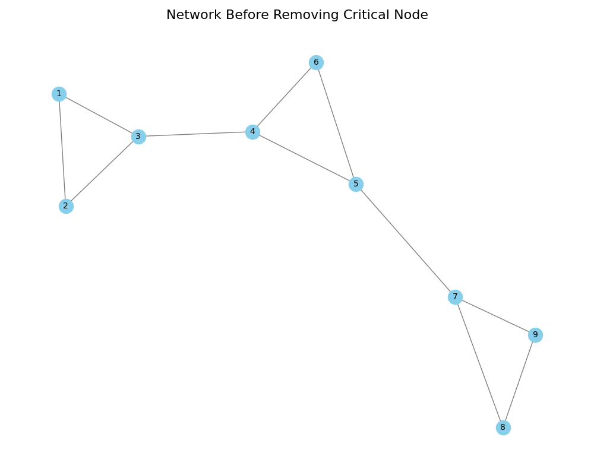

# Network Connectivity and Components

Network Analysis - Lecture 4
Nikola Balic, Faculty of Natural Science, University of Split
Data Science and Engineering Master Program

26/03/2025

---

## Overview

- Connected components in undirected graphs
- Strongly and weakly connected components in directed graphs
- Articulation points (cut vertices)
- Bridges (cut edges)
- Network resilience and vulnerability
- Practical applications

---

## Connected Components

A **connected component** is a subgraph in which any two vertices are connected to each other by paths.

In an undirected graph, a connected component is a maximal connected subgraph, which means:
- It contains all possible edges between its vertices from the original graph
- It cannot be made any larger while maintaining connectivity
- Adding any other vertex from the graph would break the connectivity property

---


The left side shows three distinct components in a graph. The right side illustrates why {A,B} is not maximal (it can include F), while {A,B,F} is maximal (it cannot grow further).

---

Key properties:
- Every vertex belongs to exactly one connected component
- The largest connected component is often called the **Giant Connected Component (GCC)**
- Components are separated by the absence of edges between them

---

For example:
```
A -- B    C -- D    E
     \
      F
```
In this graph:
- {A,B,F} forms a maximal connected subgraph because:
  - All vertices can reach each other
  - Adding any other vertex (C,D,E) would break connectivity
- {C,D} forms another maximal connected subgraph
- {E} forms a single-vertex component

---

## Connected Components Example


---

This example shows three distinct connected components:
- **Component 1**: A complete graph (K3) where all nodes are connected to each other
- **Component 2**: A star-like structure with a central node connected to multiple leaves
- **Component 3**: A path graph showing a linear connection pattern

Each component is colored differently to highlight the separation between subgraphs.

---

## Finding Connected Components in NetworkX

```python
import networkx as nx

# Create a graph with multiple components
G = nx.Graph()
G.add_edges_from([(1, 2), (1, 3), (2, 3), (4, 5), (6, 7)])

# Find all connected components
components = list(nx.connected_components(G))
print(f"Number of components: {len(components)}")

# Get the largest connected component (GCC)
gcc = max(components, key=len)
print(f"Size of GCC: {len(gcc)}")

# Create a subgraph of the largest component
gcc_subgraph = G.subgraph(gcc)
```

---

## Directed Graph Connectivity

In directed graphs, connectivity is more complex:

- **Strongly Connected Component (SCC)**: A subgraph where there is a directed path from any vertex to any other vertex
- **Weakly Connected Component (WCC)**: A subgraph that would be connected if the directed edges were replaced with undirected edges

---

## Strongly Connected Components Example


---

This example shows three different types of strongly connected components (SCCs):
- **SCC 1**: A directed cycle where nodes form a circular path (1 → 2 → 3 → 1)
- **SCC 2**: A complex component with multiple cycles and a bidirectional edge
- **SCC 3**: A simple bidirectional pair of nodes

Note the dashed gray arrows between components - these connections do not create new SCCs because they only provide one-way paths between components.

Key characteristics:
- Within each SCC, every node can reach every other node via directed paths
- Different colors highlight distinct SCCs
- The layout emphasizes the internal structure of each component

---

## Finding Strongly Connected Components in NetworkX

```python
import networkx as nx

# Create a directed graph
G = nx.DiGraph()
G.add_edges_from([(1, 2), (2, 3), (3, 1), (3, 4), (4, 5), (5, 6), (6, 4)])

# Find strongly connected components
sccs = list(nx.strongly_connected_components(G))
print(f"Number of SCCs: {len(sccs)}")

# Find weakly connected components
wccs = list(nx.weakly_connected_components(G))
print(f"Number of WCCs: {len(wccs)}")
```

---

## Articulation Points (Cut Vertices)

An **articulation point** (or cut vertex) is a vertex whose removal increases the number of connected components.

- Critical nodes that can disconnect the network
- Important for identifying network vulnerabilities
- Removing an articulation point breaks the graph into multiple components

---

## Articulation Points Example


---

## Finding Articulation Points in NetworkX

```python
import networkx as nx

# Create a graph
G = nx.Graph()
G.add_edges_from([(1, 2), (1, 3), (2, 3), (3, 4), (4, 5), (4, 6), (5, 6)])

# Find articulation points
cut_vertices = list(nx.articulation_points(G))
print(f"Articulation points: {cut_vertices}")

# Check connectivity before and after removing a cut vertex
print(f"Connected components before: {nx.number_connected_components(G)}")
G.remove_node(cut_vertices[0])
print(f"Connected components after: {nx.number_connected_components(G)}")
```

---

## Bridges (Cut Edges)

A **bridge** (or cut edge) is an edge whose removal increases the number of connected components.

- Critical connections that can disconnect the network
- Important for identifying network vulnerabilities
- Similar to articulation points but for edges

---

## Bridges Example


---

## Finding Bridges in NetworkX

```python
import networkx as nx

# Create a graph
G = nx.Graph()
G.add_edges_from([(1, 2), (1, 3), (2, 3), (3, 4), (4, 5), (4, 6), (5, 6)])

# Find bridges
bridges = list(nx.bridges(G))
print(f"Bridges: {bridges}")

# Check connectivity before and after removing a bridge
print(f"Connected components before: {nx.number_connected_components(G)}")
G.remove_edge(*bridges[0])
print(f"Connected components after: {nx.number_connected_components(G)}")
```

---

## Network Resilience

Network resilience refers to a network's ability to maintain its connectivity when nodes or edges are removed.

- **Random failures**: Random removal of nodes or edges
- **Targeted attacks**: Removal of high-degree nodes or critical nodes
- **Cascading failures**: Failures that trigger additional failures

---

## Impact of Removing Critical Nodes



---

## Analyzing Network Resilience in NetworkX

```python
import networkx as nx
import matplotlib.pyplot as plt
import numpy as np

# Create a scale-free network
G = nx.barabasi_albert_graph(100, 2, seed=42)

# Measure connectivity as nodes are removed
results = []
for i in range(30):
    # Remove highest degree node
    if len(G.nodes()) > 0:
        node_to_remove = max(G.degree, key=lambda x: x[1])[0]
        G.remove_node(node_to_remove)

        # Measure size of largest component
        if len(G.nodes()) > 0:
            gcc_size = len(max(nx.connected_components(G), key=len))
            results.append(gcc_size / len(G.nodes()))


```

---

## Applications of Network Connectivity Analysis

- **Infrastructure networks**: Identifying critical points in power grids, transportation networks
- **Communication networks**: Ensuring robustness of internet and telecommunication systems
- **Biological networks**: Understanding resilience in protein interaction networks
- **Social networks**: Identifying key individuals who connect different communities

---

## Coding Task: Analyzing Transportation Network

Analyze the connectivity of a transportation network after removing critical nodes:

1. Create a graph representing a transportation network
2. Identify articulation points and bridges
3. Analyze how removing these critical elements affects connectivity
4. Visualize the network before and after removal
5. Suggest strategies to improve network resilience

---

## Summary

- Connected components help us understand the structure of networks
- Strongly and weakly connected components apply to directed graphs
- Articulation points and bridges are critical for network vulnerability analysis
- Network resilience measures a network's ability to maintain connectivity
- Connectivity analysis has applications across many domains

---

## References

- Newman, M. E. J. (2018). Networks. Oxford University Press.
- Barabási, A. L. (2016). Network Science. Cambridge University Press.
- Easley, D., & Kleinberg, J. (2010). Networks, Crowds, and Markets. Cambridge University Press.
- NetworkX documentation: https://networkx.org/documentation/stable/reference/algorithms/connectivity.html

---

# Appendix: Transportation Network Analysis Solution

---

## Network Structure

We create a transportation network representing cities and their connections:
- 10 cities (nodes) labeled A through J
- A is a central hub connecting north and south
- J is a southern hub
- Multiple paths between major cities for redundancy
- Mix of direct and indirect connections

---

## Network Analysis Results


The analysis reveals:
- Critical nodes (red): Cities that would disconnect the network if removed
- Critical edges (blue): Connections that would disconnect the network if broken
- Most vulnerable: Central hub (A) connecting north and south regions

---

## Impact of Node Removal


Removing the central hub (A):
- Network splits into multiple disconnected components
- Northern cities lose direct access to southern cities
- Demonstrates the vulnerability of centralized networks

---

## Network Resilience Metrics

Key metrics for assessing network vulnerability:
```python
metrics = {
    'Average Degree': 2.8,              # Connectivity level
    'Clustering Coefficient': 0.34,      # Local redundancy
    'Number of Components': 1,           # Network is connected
    'Average Path Length': 2.46,         # Typical city-to-city distance
    'Articulation Points': 3,            # Critical nodes
    'Bridges': 4                         # Critical edges
}
```

---

## Strategies to Improve Resilience

1. **Add Redundant Connections**:
   - Create alternative paths between components
   - Focus on connecting regions through multiple routes
   - Add direct links between peripheral cities

2. **Decentralize the Network**:
   - Reduce dependence on central hubs
   - Create regional sub-hubs
   - Distribute critical connections

---

3. **Strengthen Critical Points**:
   - Enhance capacity of critical nodes
   - Build backup systems for vulnerable connections
   - Implement fail-safe mechanisms

4. **Regular Monitoring**:
   - Continuously assess network metrics
   - Identify emerging vulnerabilities
   - Plan preemptive improvements

---

## Implementation Code

The complete solution is available in `generate_transport_network.py`:
```python
def create_transport_network():
    """Create a transportation network representing cities and connections."""
    G = nx.Graph()

    # Add cities with positions
    cities = {
        'A': (0, 0),      # Central hub
        'B': (-1, 1),     # Northern city
        'C': (1, 1),      # Northern city
        # ... more cities ...
    }

    # Add transportation links
    edges = [
        ('A', 'B'), ('A', 'C'),  # Northern connections
        ('A', 'F'), ('A', 'G'),  # Southern connections
        # ... more connections ...
    ]
    G.add_edges_from(edges)

    return G, cities


```

---

```python
def analyze_network(G, pos):
    """Analyze network vulnerability and visualize critical elements."""
    # Find critical elements
    articulation_points = list(nx.articulation_points(G))
    bridges = list(nx.bridges(G))

    # Visualize the network with highlighted critical elements
    # ... visualization code ...

    return articulation_points, bridges
```