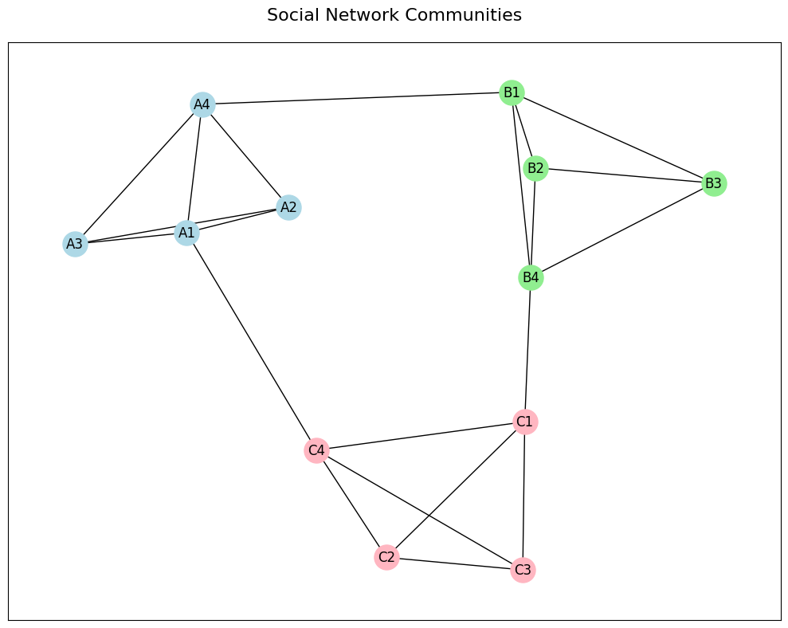
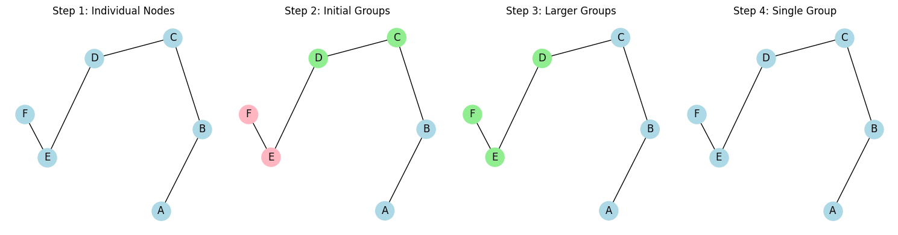
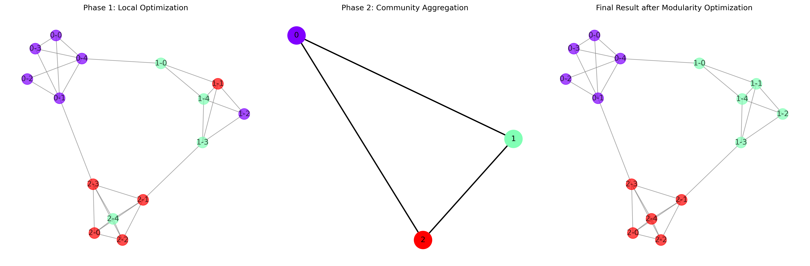
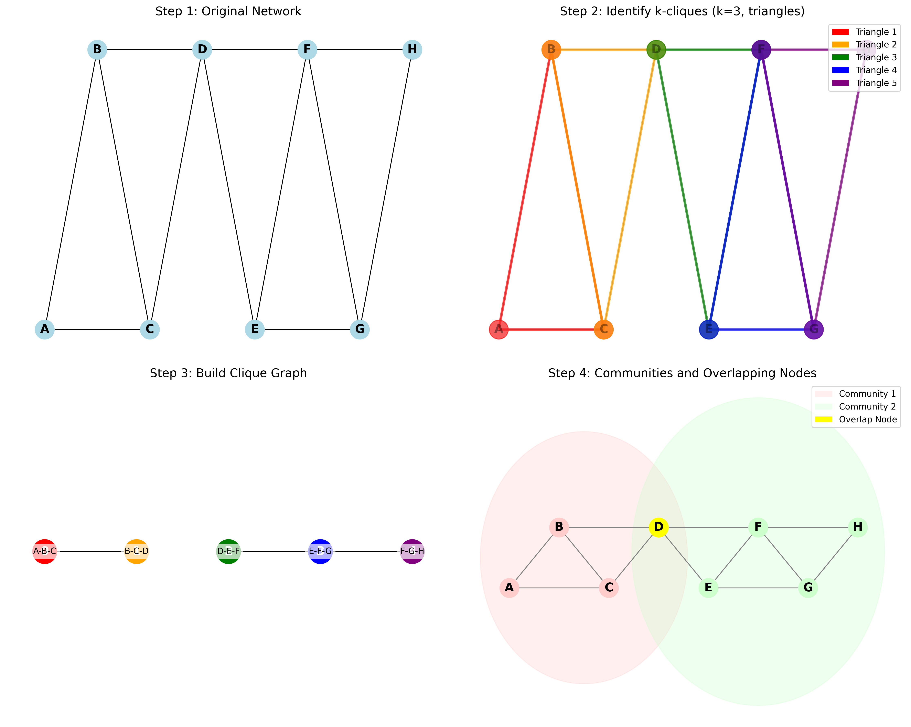
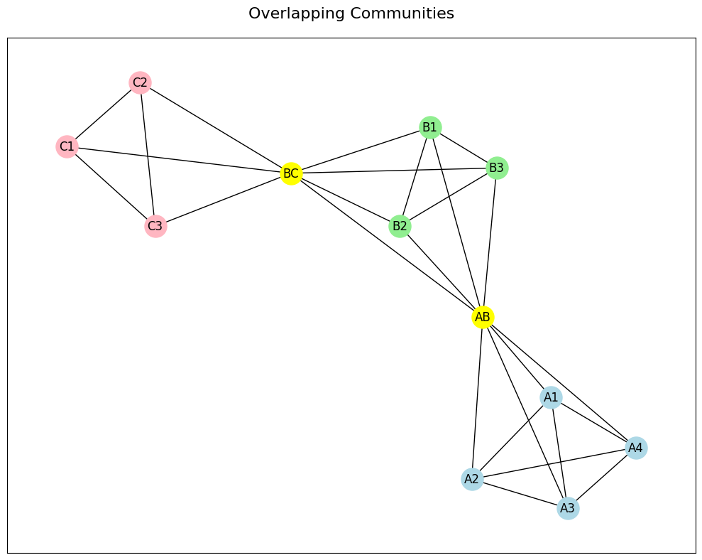
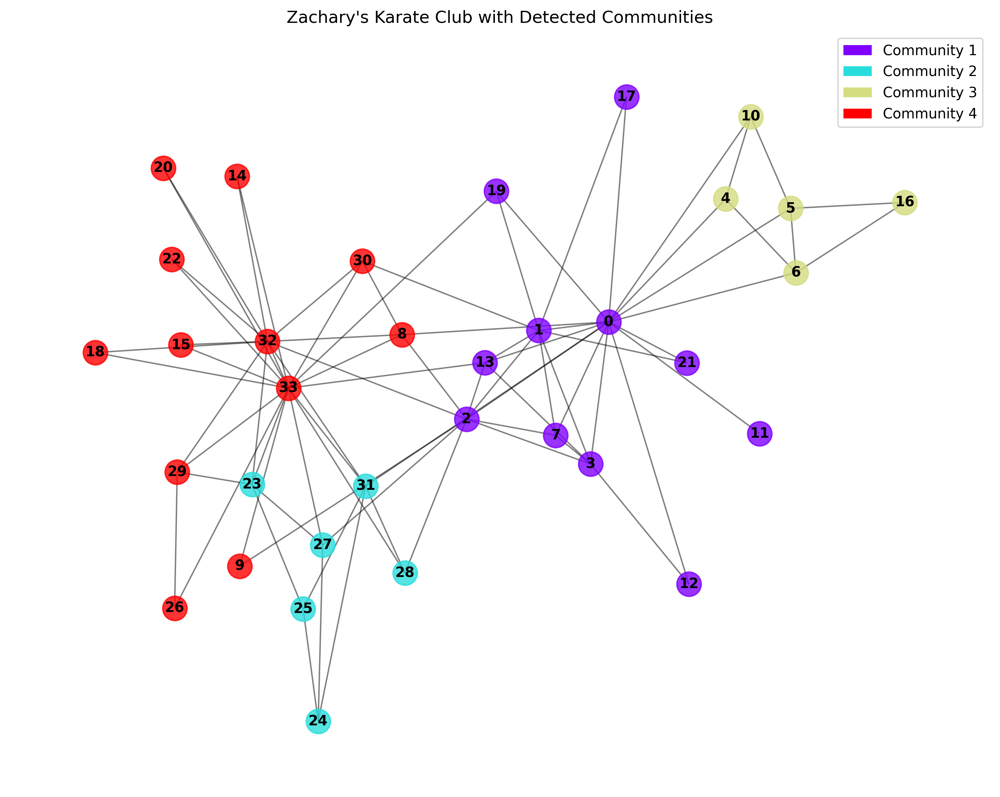
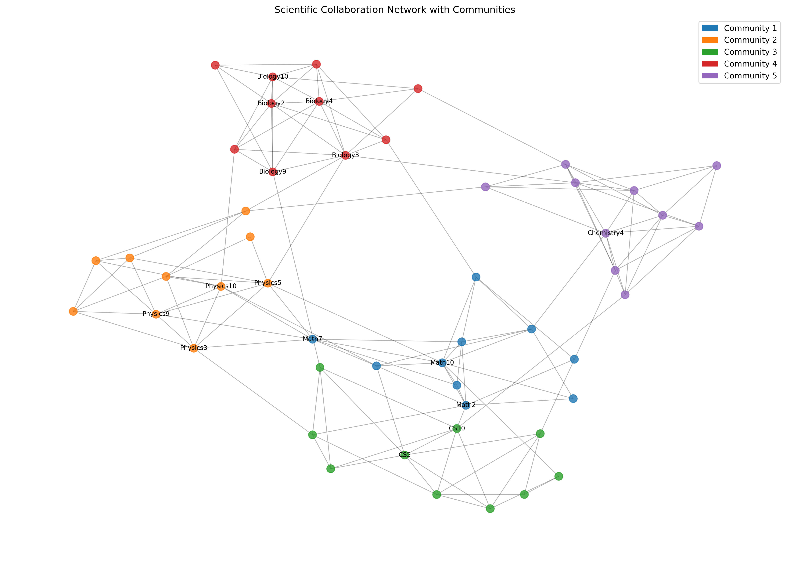

# Community Detection in Networks
## Finding Groups in Connected Data

Network Analysis - Lecture 5
Nikola Balic, Faculty of Natural Science, University of Split
Data Science and Engineering Master Program

02/04/2025

---

## What We'll Learn Today

- What are communities in networks?
- How to find communities in networks
- Simple methods to detect communities
- How to measure if our communities are good
- Real-world examples and applications

Think of this like finding friend groups in your social network!

---

## What is a Community?

A **community** in a network is:
- A group of nodes that are more densely connected to each other than to the rest of the network
- Often represents functional units or groups with similar properties
- May overlap or be hierarchical in structure

Communities reflect the natural divisions in a network, such as social groups, protein functions, or topic clusters.

---

## Example: Communities in Social Networks



---

## Modularity

**Modularity** is a measure of the quality of a network division into communities.

- Measures the density of links inside communities compared to links between communities
- Higher values indicate better community separation
- Values range from -0.5 to 1.0 (typically 0.3-0.7 for networks with community structure)

---

## Modularity Formula: Intuition

Modularity compares the actual network structure with a random network:

- **Q > 0**: More connections within communities than expected by chance
- **Q = 0**: Community structure no better than random
- **Q < 0**: Fewer connections within communities than expected by chance

The formula quantifies: "How much better is this division than random?"

---

## Modularity Formula: Components

$Q = \frac{1}{2m}\sum_{ij} \left[ A_{ij} - \frac{k_i k_j}{2m} \right] \delta(c_i, c_j)$

Breaking down each component:

- $A_{ij}$: Actual connections between nodes (1 if connected, 0 if not)
- $\frac{k_i k_j}{2m}$: Expected connections in a random network with the same degree distribution
- $\delta(c_i, c_j)$: Community indicator (1 if in same community, 0 otherwise)
- $\frac{1}{2m}$: Normalization factor (m = total number of edges)

---


## Modularity: Practical Example

Consider a simple network with two communities:
- Community 1: Nodes A, B, C (densely connected)
- Community 2: Nodes D, E, F (densely connected)
- Few connections between communities

High modularity would indicate:
- Many edges within communities (high $A_{ij}$ when $c_i = c_j$)
- Few edges between communities (low $A_{ij}$ when $c_i \neq c_j$)
- Significantly different from what would be expected in a random network

---

## Modularity Optimization

Modularity optimization methods:
- Find communities by maximizing the modularity metric
- Higher modularity = better community structure
- Key challenge: Computational complexity (NP-hard problem)

Popular implementations:
- Greedy algorithms (Newman's algorithm)
- Louvain method (faster and more effective)

---

## Community Detection Algorithms

1. **Hierarchical Clustering**
   - Agglomerative (bottom-up): Start with each node in its own community and merge
   - Divisive (top-down): Start with one community and split

2. **Louvain Method**
   - Fast, accurate modularity optimization algorithm
   - Works well on large networks

---

3. **Spectral Methods**
   - Use eigenvectors of matrices representing the network

4. **Label Propagation**
   - Fast, near-linear time algorithm
   - Nodes adopt the label most common among neighbors

---

## Hierarchical Clustering

**Agglomerative (bottom-up) approach**:
1. Start with each node in its own community
2. Iteratively merge the communities that are most similar
3. Continue until all nodes are in a single community
4. Create a dendrogram to visualize the hierarchy

Similarity can be measured by:
- Number of edges between communities
- Normalized cut between communities
- Modularity gain when merging communities

---

## Example: Hierarchical Clustering



This example shows:
- The progression of agglomerative clustering
- A dendrogram (right) showing merge order and similarity levels
- How communities are hierarchically organized

---

## Louvain Method

A fast, multi-level algorithm for community detection:

**Phase 1: Local optimization**
1. Start with each node in its own community
2. For each node, calculate modularity gain of moving to a neighbor's community
3. Place node in community that maximizes modularity gain
4. Repeat until no improvement is possible

**Phase 2: Community aggregation**
1. Create a new network where nodes are the communities from phase 1
2. Repeat phase 1 on this new network
3. Continue until maximum modularity is reached

---

## Example: Louvain Method Execution



The Louvain method efficiently discovers communities by:
1. Initially optimizing each node's community assignment
2. Then collapsing communities into super-nodes
3. Repeating the process hierarchically

This approach scales well to large networks while maintaining high-quality results.

---

## Spectral Clustering

Spectral clustering uses the eigenvectors of network-related matrices:

1. Construct the Laplacian matrix of the graph
2. Compute eigenvectors of the Laplacian
3. Use the eigenvectors to project nodes into a lower-dimensional space
4. Apply standard clustering algorithms (e.g., k-means) in this space

Benefits:
- Can find non-obvious community structures
- Well-grounded in mathematical theory
- Effective on a wide range of network types

---

## Spectral Clustering: Step by Step Example

Let's work through a simple spectral clustering example:

**Step 1: Create the adjacency matrix A**
For a network with 5 nodes:
```
A = [0 1 1 0 0]
    [1 0 1 0 0]
    [1 1 0 1 0]
    [0 0 1 0 1]
    [0 0 0 1 0]
```
---

**Step 2: Compute the degree matrix D**
```
D = [2 0 0 0 0]
    [0 2 0 0 0]
    [0 0 3 0 0]
    [0 0 0 2 0]
    [0 0 0 0 1]
```

---

## Spectral Clustering: Step by Step Example (cont.)

**Step 3: Calculate the Laplacian matrix L = D - A**
```
L = [2 -1 -1  0  0]
    [-1  2 -1  0  0]
    [-1 -1  3 -1  0]
    [ 0  0 -1  2 -1]
    [ 0  0  0 -1  1]
```

**Step 4: Find eigenvectors of L**
The second smallest eigenvector (also called the Fiedler vector) gives approximate community assignments based on the sign of its entries.

**Step 5: Apply k-means clustering on eigenvectors**
In this example, the signs of the Fiedler vector entries would suggest dividing the network into two communities: {1,2,3} and {4,5}

---

## Label Propagation Algorithm

A simple, efficient method for community detection:

1. Assign each node a unique label
2. Iteratively update each node's label to the most frequent label among its neighbors
3. Break ties randomly
4. Stop when labels no longer change (or after a fixed number of iterations)

Key advantages:
- Near-linear time complexity
- Easy to implement
- No parameters to tune
- Can be easily adapted for distributed computing

---

## Label Propagation: Visual Step by Step

Let's see how label propagation works on a simple network:

**Initial State**:
- Each node starts with its own unique label (color)
- Labels: A:red, B:blue, C:green, D:yellow, E:purple, F:orange, G:pink

**Round 1**:
- Node A sees labels [B:blue, C:green] → Chooses blue
- Node B sees labels [A:red, C:green, D:yellow] → Chooses red (ties broken randomly)
- Continuing this process for all nodes...

---

## Label Propagation: Visual Step by Step (cont.)

**Round 2**:
- Node propagation continues with updated labels
- Some nodes will maintain their labels, others will change
- Densely connected groups begin to share the same label

**Final State** (after several iterations):
- Nodes in the same community converge to the same label
- The algorithm stabilizes when no more changes occur
- The result: A natural division of the network into communities

This approach relies purely on the network structure and requires no prior knowledge of the number or size of communities.

---

## Evaluating Community Detection

**Internal evaluation metrics**:
- Modularity
- Conductance (ratio of external to internal edges)
- Coverage (fraction of edges within communities)

**External evaluation (with known communities)**:
- Normalized Mutual Information (NMI)
- Adjusted Rand Index (ARI)
- F1 score

**Visual inspection**:
- Check if communities make intuitive sense
- Visualize community structures

---

## Evaluation Metrics: Detailed Explanations

### Internal Metrics (no ground truth needed):

**Modularity (Q)**:
- Measures the quality of a community division
- Q = (fraction of edges within communities) - (expected fraction in a random network)
- Range: -0.5 to 1.0; higher is better
- Example: Q = 0.7 indicates strong community structure

---

**Conductance (φ)**:
- Ratio of external edges to total edges connected to the community
- φ = (external edges) / (all edges connected to community)
- Range: 0 to 1; lower is better
- Example: φ = 0.1 means only 10% of edges cross community boundaries

---

## Evaluation Metrics: Detailed Explanations (cont.)

### External Metrics (require ground truth):

**Normalized Mutual Information (NMI)**:
- Measures how much information is shared between detected and ground truth communities
- NMI = 0: No relationship between detected and true communities
- NMI = 1: Perfect match with ground truth
- Example: NMI = 0.85 indicates strong agreement with ground truth

---

**Adjusted Rand Index (ARI)**:
- Measures similarity between detected and ground truth communities
- Adjusts for chance groupings
- Range: -1 to 1; higher is better
- Example: ARI = 0.7 indicates good agreement with ground truth

---

## Community Detection in NetworkX

```python
import networkx as nx
import community as community_louvain
import matplotlib.pyplot as plt
import matplotlib.cm as cm

# Create a network
G = nx.karate_club_graph()

# Apply Louvain method
communities = community_louvain.best_partition(G)

# Visualize the communities
pos = nx.spring_layout(G)
colors = [communities[node] for node in G.nodes()]
nx.draw(G, pos, node_color=colors, cmap=plt.cm.rainbow,
        with_labels=True, node_size=500)
plt.show()
```

---

## Resolution Limit

**Resolution limit**: Modularity-based methods have difficulty detecting small communities in large networks.

- Communities smaller than $\sqrt{2m}$ (where $m$ is the number of edges) may not be detected
- Can lead to the merging of small, distinct communities
- Solutions:
  - Resolution parameter in modified modularity functions
  - Multi-resolution methods
  - Local community detection algorithms

---

## Overlapping Communities

Many real networks have **overlapping communities** where nodes belong to multiple groups:

- A person can belong to multiple social circles
- A protein can participate in multiple biological processes
- A document can cover multiple topics

Algorithms for detecting overlapping communities:
- Clique Percolation Method (CPM)
- COPRA (Community Overlap PRopagation Algorithm)
- BigCLAM
- DEMON (Democratic Estimate of the Modular Organization of a Network)

---

## Clique Percolation Method (CPM): Step by Step

The Clique Percolation Method (CPM) is popular for finding overlapping communities:

**Step 1: Find all k-cliques in the network**
- A k-clique is a complete subgraph of k nodes (all nodes connected to each other)
- Typically k=3 (triangles) or k=4 are used

**Step 2: Build a clique graph**
- Nodes = k-cliques from the original graph
- Edges = pairs of k-cliques that share k-1 nodes
- Example: Two triangles sharing 2 nodes would be connected

---

## Clique Percolation Method: Step by Step (cont.)

**Step 3: Find connected components in the clique graph**
- Each connected component becomes a community
- These communities can overlap in the original network

**Step 4: Map communities back to original nodes**
- Each node can belong to multiple communities
- Nodes in overlapping regions bridge different communities

---

**Example**:
- For k=3, triangles ABC and BCD share nodes B and C
- They form a community {A,B,C,D}
- If triangles DEF and EFG also form a community {D,E,F,G}
- Node D belongs to both communities → overlapping community structure

---

## Clique Percolation Method: Visual Example



The Clique Percolation Method identifies overlapping communities:
1. **Top-Left**: Original network
2. **Top-Right**: Identify all triangles (3-cliques)
3. **Bottom-Left**: Create clique graph where triangles sharing 2 nodes are connected
4. **Bottom-Right**: Find communities and identify overlapping nodes (node D)

---

## Example: Overlapping Communities



In this network:
- Node a belongs to both the blue and green communities
- Node g belongs to both the green and orange communities
- Most nodes belong to just one community
- Overlapping nodes often serve as bridges between communities

---

## Case Study: Zachary's Karate Club

Revisiting the karate club network from the previous lecture:

- Network represents friendships in a karate club that split into two groups
- Can community detection algorithms recover this division?



The Louvain method accurately identifies the communities that match the actual split.

---

## Case Study: Scientific Collaboration Network



This visualization shows communities in a co-authorship network:
- Nodes are researchers
- Edges represent co-authorship
- Colors indicate detected communities
- Communities often align with research topics or departments
- Bridge nodes represent interdisciplinary researchers

---

## Applications

**Social network analysis**:
- Identifying cohesive groups
- Targeted marketing and recommendations
- Detecting influential community leaders

**Biological networks**:
- Protein function prediction
- Disease module identification
- Drug target discovery

---

**Information networks**:
- Topic modeling in document networks
- Web page clustering
- Recommendation systems

---

## Practical Application: Topic Community Detection

A common application is finding topic communities in citation networks:

1. Construct a network where:
   - Nodes = Scientific papers
   - Edges = Citations between papers

2. Apply community detection to find clusters of papers on similar topics

3. Analyze community structure to:
   - Identify emerging research areas
   - Track the evolution of scientific fields
   - Discover interdisciplinary connections

---

## Coding Task: Community Detection in Social Networks

Detect communities in a social network and visualize the community structure:

1. Load a social network dataset (e.g., Facebook, Twitter, or Email communication)
2. Implement community detection using the Louvain method
3. Visualize the communities with different colors
4. Calculate and interpret modularity and other community metrics
5. Identify bridge nodes that connect different communities
6. Compare results with ground truth if available

---

## Natural Language Task

**Question**: Discuss how community detection can be used to identify interest groups in a social media network.

Consider:
- What types of communities might exist in social media networks
- How community detection could help platforms improve user experience
- Potential challenges in accurately identifying communities
- Ethical considerations in grouping users based on network structure
- How community information might be used for content recommendations

---

## Key Takeaways

- Communities are fundamental structures in complex networks
- Multiple algorithms exist for community detection, each with strengths and limitations
- Modularity is a key metric for evaluating community quality
- Community detection has applications across diverse fields
- Consider overlapping and hierarchical community structures
- Always evaluate detected communities for meaningfulness
