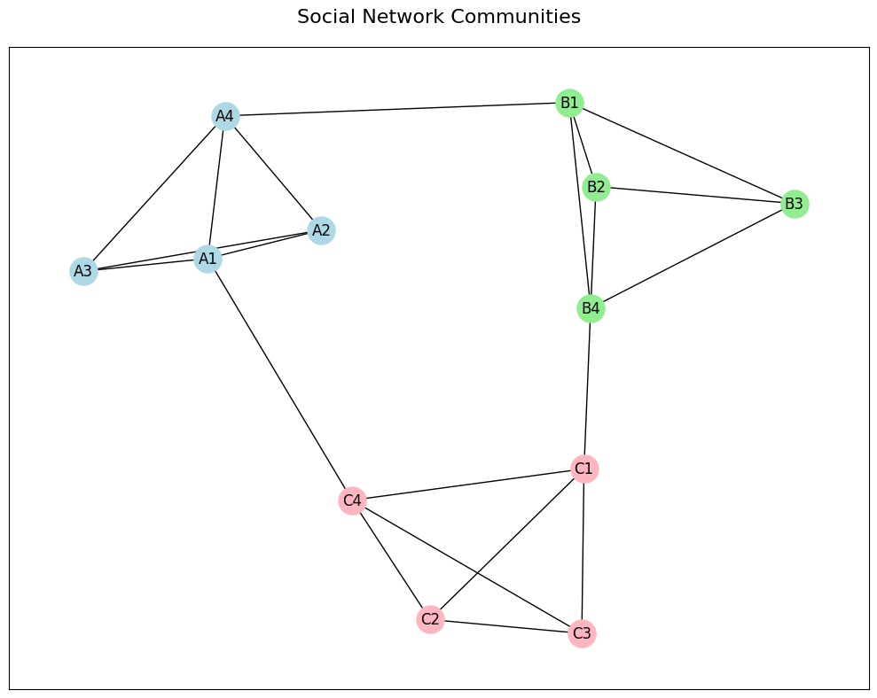
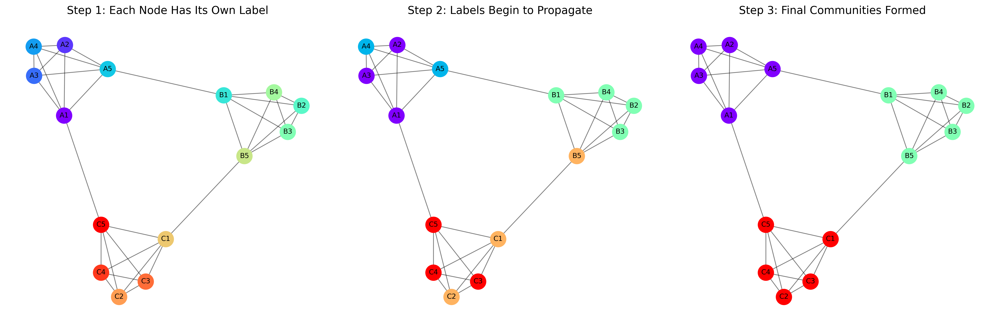
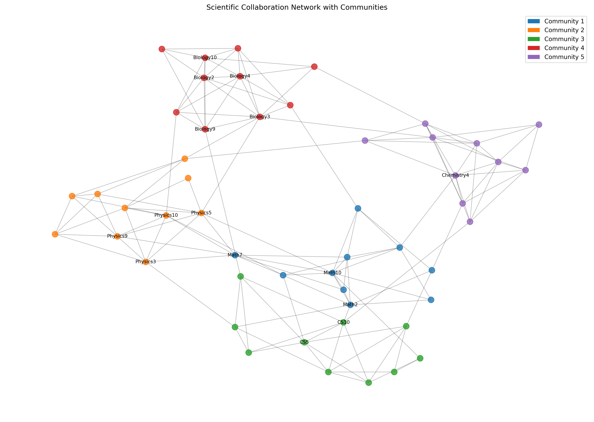

# Community Detection in Networks
## Finding Groups in Connected Data

Network Analysis - Lecture 5
Nikola Balic, Faculty of Natural Science, University of Split
Data Science and Engineering Master Program

02/04/2025

---

## What We'll Learn Today

- What are communities in networks and why they matter
- Step-by-step approaches to detect communities
- Simple community detection algorithms with examples
- How to evaluate community detection results
- Real-world applications of community detection

---

## What is a Community?

A **community** in a network is a group of nodes that are:
- More densely connected to each other than to the rest of the network
- Often share common properties or functions
- May overlap or be arranged hierarchically

**Real-world examples:**
- Friend groups in social networks
- Research topics in citation networks
- Functional modules in protein networks

---

## Visualizing Communities in Networks



In this network:
- Each color represents a different community
- Nodes in the same community are more connected to each other
- Few connections exist between different communities

---

## Why Detect Communities?

Communities help us understand network structure and function:

- **Simplify complex networks** by identifying natural groupings
- **Discover hidden relationships** between nodes
- **Predict missing connections** within communities
- **Identify key nodes** that bridge communities

Communities reveal the underlying organization of a network!

---

## Step 1: Measuring Community Quality

Before detecting communities, we need a way to measure their quality!

**Modularity** is the most common quality metric:
- Measures how well a network is divided into communities
- Compares actual connections within communities to random expectations
- Values range from -0.5 to 1.0 (higher values = better communities)

---

## Understanding Modularity: Simple Explanation

Modularity answers: "Is the community structure better than random?"

- **Q > 0**: More connections within communities than expected by chance (good)
- **Q = 0**: Community structure no better than random (neutral)
- **Q < 0**: Fewer connections within communities than expected (poor)

The higher the modularity, the more definite the community structure.

---

## NetworkX Example: Calculating Modularity


The barbell graph shows two clear communities with a high modularity value. The different colors represent the communities detected by the Louvain algorithm.

---

```python
import networkx as nx
import community as community_louvain
import matplotlib.pyplot as plt

# Create a simple network with two clear communities
G = nx.barbell_graph(5, 0)  # Two complete graphs connected by a single edge

# Use the Louvain method to detect communities
communities = community_louvain.best_partition(G)

# Calculate the modularity of this partition
modularity = community_louvain.modularity(communities, G)
print(f"Modularity: {modularity:.4f}")

# Visualize the communities
colors = [communities[node] for node in G.nodes()]
plt.figure(figsize=(8, 6))
pos = nx.spring_layout(G, seed=42)
nx.draw(G, pos, node_color=colors, cmap=plt.cm.Set1,
        with_labels=True, node_size=500)
plt.title(f"Network with Two Communities (Modularity: {modularity:.4f})")
plt.show()
```

---

## Let's Start Simple: Hierarchical Clustering

**Hierarchical clustering** builds communities from the bottom up:

1. Start with each node in its own community
2. Repeatedly merge the closest communities
3. Continue until all nodes are in a single community
4. Create a dendrogram to visualize the hierarchy

This approach works well for small to medium-sized networks.

---

## Hierarchical Clustering: Visual Step by Step


---

The process shown from left to right:
1. **Initial**: Each node in its own community
2. **Early Stage**: Most similar nodes merge
3. **Middle Stage**: Small communities form
4. **Final Stage**: All nodes in one community
5. **Dendrogram**: Shows the merge history

---

## NetworkX Example: Hierarchical Clustering

```python
import networkx as nx
import numpy as np
import matplotlib.pyplot as plt
from scipy.cluster.hierarchy import dendrogram, linkage
from scipy.spatial.distance import squareform

# Create a sample network
G = nx.karate_club_graph()

# Create a distance matrix based on shortest paths
path_length = dict(nx.all_pairs_shortest_path_length(G))
distances = np.zeros((len(G), len(G)))
for i, u in enumerate(G.nodes()):
    for j, v in enumerate(G.nodes()):
        distances[i, j] = path_length[u][v]
```
---
```python
# Convert distances to a condensed form for linkage
condensed_dist = squareform(distances)

# Perform hierarchical clustering
Z = linkage(condensed_dist, method='ward')

# Plot the dendrogram
plt.figure(figsize=(12, 6))
dendrogram(Z, labels=list(G.nodes()), leaf_rotation=90)
plt.title('Hierarchical Clustering of Karate Club Network')
plt.xlabel('Node ID')
plt.ylabel('Distance')
plt.tight_layout()
plt.show()

# Get cluster assignments at a specific level (e.g., 2 clusters)
from scipy.cluster.hierarchy import fcluster
clusters = fcluster(Z, 2, criterion='maxclust')

# Visualize the communities
plt.figure(figsize=(10, 8))
pos = nx.spring_layout(G, seed=42)
nx.draw_networkx_nodes(G, pos, node_color=clusters, cmap=plt.cm.Set1, node_size=100)
nx.draw_networkx_edges(G, pos, alpha=0.5)
plt.title('Karate Club Network Communities')
plt.axis('off')
plt.show()
```
---


---

## The Louvain Method: Fast and Effective

The **Louvain method** is one of the most popular approaches:

1. **Phase 1 (Local Optimization)**:
   - Start with each node in its own community
   - Move nodes to neighboring communities if modularity improves
   - Repeat until no improvement is possible

2. **Phase 2 (Community Aggregation)**:
   - Create a new network where nodes = communities from Phase 1
   - Repeat Phase 1 on this new network
   - Continue until maximum modularity is reached

---

## Louvain Method: Step by Step Visualization


The Louvain method works in phases:
1. **Phase 1**: Optimize each node's community placement
2. **Phase 2**: Collapse communities into supernodes
3. **Final**: Repeat until optimal modularity is achieved

<!-- Left Panel (Phase 1: Local Optimization)

  This first phase shows the initial community detection:
  - Each node starts in its own community and then moves to neighboring communities that maximize modularity gain
  - You can see that nodes with similar colors have been grouped together
  - This is a greedy local optimization where each node finds its best community

  Middle Panel (Phase 2: Community Aggregation)

  This shows what happens after the first phase completes:
  - The communities found in Phase 1 are collapsed into "super-nodes"
  - Each super-node represents an entire community (the colored clusters from Phase 1)
  - The edges between super-nodes represent the connections between communities
  - This compression preserves the network's community structure while simplifying it

  Right Panel (Final Result)

  This shows the final outcome after iteratively applying both phases:
  - The algorithm repeats Phases 1 and 2 until no further improvement in modularity is possible
  - Each color represents a distinct community in the network
  - These communities maximize internal connections while minimizing external ones
  - The final partition has a high modularity value, indicating good community structure

  The strength of the Louvain method is this multi-level approach - by collapsing communities and repeating the process, it can efficiently find
  community structure at different scales, making it effective for both small and large networks.-->

---

## NetworkX Example: Louvain Method

```python
import networkx as nx
import community as community_louvain
import matplotlib.pyplot as plt
import matplotlib.cm as cm

# Create a network (using the Karate Club as an example)
G = nx.karate_club_graph()

# Apply the Louvain method
communities = community_louvain.best_partition(G)

# Count the number of communities
num_communities = len(set(communities.values()))
print(f"Number of communities detected: {num_communities}")

# Calculate the modularity
modularity = community_louvain.modularity(communities, G)
print(f"Modularity: {modularity:.4f}")
```

---

```python
# Visualize the communities
plt.figure(figsize=(10, 8))
pos = nx.spring_layout(G, seed=42)

# Color nodes based on community
cmap = cm.get_cmap('viridis', max(communities.values()) + 1)
nx.draw_networkx_nodes(G, pos, communities.keys(),
                       node_size=250,
                       cmap=cmap,
                       node_color=list(communities.values()))
nx.draw_networkx_edges(G, pos, alpha=0.5)
nx.draw_networkx_labels(G, pos, font_size=10)

plt.title(f"Communities in Karate Club Network\nModularity: {modularity:.4f}")
plt.axis('off')
plt.show()
```

This example applies the Louvain method to the Zachary's Karate Club network and visualizes the detected communities.

---

## Label Propagation: A Simple, Fast Approach

**Label Propagation** is intuitive and easy to understand:

1. Assign each node a unique label (community ID)
2. Iteratively update each node's label to the most common label among its neighbors
3. Break ties randomly
4. Stop when labels stabilize (or after a fixed number of iterations)

Advantages:
- Near-linear time complexity (very fast)
- Easy to implement and understand
- Works well for large networks

---

## Label Propagation: Visual Example



The label propagation process happens in stages:

1. **Initial State:** Each node starts with a unique label (color)
2. **Propagation Steps:** Nodes adopt the most frequent label from their neighbors
3. **Final State:** Nodes in densely connected groups converge to the same label

---

## NetworkX Example: Label Propagation

```python
import networkx as nx
import matplotlib.pyplot as plt
import numpy as np

# Create a network with community structure
G = nx.karate_club_graph()

# Apply label propagation
communities = nx.algorithms.community.label_propagation_communities(G)

# Convert communities to a dictionary for visualization
community_map = {}
for i, community in enumerate(communities):
    for node in community:
        community_map[node] = i
```
---
```python
# Visualize the communities
plt.figure(figsize=(10, 8))
pos = nx.spring_layout(G, seed=42)

# Color nodes based on community
colors = [community_map[node] for node in G.nodes()]
nx.draw(G, pos, node_color=colors, cmap=plt.cm.rainbow,
        with_labels=True, node_size=500)

plt.title("Communities Detected by Label Propagation")
plt.axis('off')
plt.show()

# Print statistics
print(f"Number of communities detected: {len(set(community_map.values()))}")
# You can't directly calculate modularity with NetworkX's implementation
# but you could convert the communities to the format required by community_louvain
```

Label propagation is simpler to understand than the Louvain method, making it a good introduction to community detection.

---

## Evaluating Community Detection Results

How do we know if our communities are good?

**Internal evaluation** (without ground truth):
- **Modularity**: Higher values indicate better separation
- **Conductance**: Ratio of external to internal edges (lower is better)
- **Coverage**: Fraction of edges within communities (higher is better)

**External evaluation** (with known communities):
- **Normalized Mutual Information (NMI)**: Measures information shared between detected and true communities
- **Adjusted Rand Index (ARI)**: Measures similarity between community assignments

---

## NetworkX Example: Evaluating Communities

```python
import networkx as nx
import community as community_louvain
from sklearn.metrics import normalized_mutual_information_score, adjusted_rand_score

# Create a network with known communities (barbell graph)
G = nx.barbell_graph(5, 0)

# Define ground truth communities
true_communities = {}
for i in range(10):
    if i < 5:
        true_communities[i] = 0  # First community
    else:
        true_communities[i] = 1  # Second community

# Detect communities using the Louvain method
detected = community_louvain.best_partition(G)
```
---
```python
# Calculate modularity
modularity = community_louvain.modularity(detected, G)
print(f"Modularity: {modularity:.4f}")

# Convert to lists for sklearn metrics
true_labels = [true_communities[i] for i in sorted(G.nodes())]
detected_labels = [detected[i] for i in sorted(G.nodes())]

# Calculate external metrics
nmi = normalized_mutual_information_score(true_labels, detected_labels)
ari = adjusted_rand_score(true_labels, detected_labels)

print(f"Normalized Mutual Information: {nmi:.4f}")
print(f"Adjusted Rand Index: {ari:.4f}")
```

This example shows how to evaluate community detection results both with and without ground truth.

---

## Overlapping Communities: When Nodes Belong to Multiple Groups

In real networks, nodes often belong to multiple communities:
- A person can be part of multiple social circles
- A protein can participate in several biological functions
- A document can cover multiple topics

**Clique Percolation Method (CPM)** is popular for finding overlapping communities:
1. Find all k-cliques (fully connected subgraphs of k nodes)
2. Connect cliques that share k-1 nodes
3. Each connected component of cliques forms a community

---

## Clique Percolation Method: Step by Step


The process of finding overlapping communities:
1. **Original Network**: The network we want to analyze
2. **Find k-cliques**: Identify all triangles (3-cliques)
3. **Build Clique Graph**: Connect cliques that share k-1 nodes
4. **Identify Communities**: Map connected components back to original network

---

## NetworkX Example: Clique Percolation Method

```python
import networkx as nx
import matplotlib.pyplot as plt
import numpy as np
from networkx.algorithms.community import k_clique_communities

# Create a simple network with overlapping communities
G = nx.Graph()
# First community
G.add_edges_from([(0, 1), (0, 2), (1, 2), (1, 3), (2, 3)])
# Second community
G.add_edges_from([(3, 4), (3, 5), (4, 5), (4, 6), (5, 6)])

# Find overlapping communities using k-clique percolation (k=3)
communities = list(k_clique_communities(G, 3))

# Print communities
print("Overlapping communities:")
for i, community in enumerate(communities):
    print(f"Community {i+1}: {community}")

# Find overlapping nodes
all_nodes = set()
for community in communities:
    all_nodes.update(community)

overlapping = set()
for node in all_nodes:
    count = sum(1 for community in communities if node in community)
    if count > 1:
        overlapping.add(node)

print(f"Overlapping nodes: {overlapping}")

# Visualize
plt.figure(figsize=(10, 8))
pos = nx.spring_layout(G, seed=42)

# Draw regular nodes
nx.draw_networkx_nodes(G, pos, nodelist=list(all_nodes - overlapping),
                      node_color='lightblue', node_size=500)
# Draw overlapping nodes
nx.draw_networkx_nodes(G, pos, nodelist=list(overlapping),
                      node_color='yellow', node_size=500)
nx.draw_networkx_edges(G, pos)
nx.draw_networkx_labels(G, pos)

plt.title("Overlapping Communities")
plt.axis('off')
plt.show()
```

This example implements the Clique Percolation Method to find overlapping communities.

---

## Case Study: Zachary's Karate Club

Let's revisit the famous Karate Club network:


- Network represents friendships in a karate club that split into two groups
- Community detection can recover this split without prior knowledge
- Different algorithms find slightly different community structures

---

## Complete Example: Community Detection on Karate Club

```python
import networkx as nx
import community as community_louvain
import matplotlib.pyplot as plt
import matplotlib.cm as cm
import numpy as np

# Create the karate club graph
G = nx.karate_club_graph()

# Get the actual split that happened (ground truth)
# Node 0 is Mr. Hi (instructor) and node 33 is John A (administrator)
true_communities = {}
for node in G.nodes():
    # Club actually split into two factions
    if node in [0, 1, 2, 3, 4, 5, 6, 7, 8, 10, 11, 12, 13, 16, 17, 19, 21]:
        true_communities[node] = 0  # Mr. Hi's group
    else:
        true_communities[node] = 1  # John A's group

# Apply the Louvain method for community detection
detected_communities = community_louvain.best_partition(G)

# Calculate modularity
modularity = community_louvain.modularity(detected_communities, G)
print(f"Modularity of detected communities: {modularity:.4f}")

# Compare detected with true communities
matches = sum(1 for node in G.nodes()
              if true_communities[node] == detected_communities[node])
accuracy = matches / len(G.nodes())
print(f"Accuracy compared to true split: {accuracy:.2%}")

# Visualize both true and detected communities
fig, (ax1, ax2) = plt.subplots(1, 2, figsize=(15, 7))

# Use the same layout for both visualizations
pos = nx.spring_layout(G, seed=42)

# Draw true communities
nx.draw_networkx_nodes(G, pos, ax=ax1,
                     node_color=[true_communities[n] for n in G.nodes()],
                     cmap=cm.get_cmap('Set1', 2),
                     node_size=300)
nx.draw_networkx_edges(G, pos, ax=ax1, alpha=0.5)
nx.draw_networkx_labels(G, pos, ax=ax1, font_size=10)
ax1.set_title("True Communities")
ax1.axis('off')

# Draw detected communities
nx.draw_networkx_nodes(G, pos, ax=ax2,
                     node_color=[detected_communities[n] for n in G.nodes()],
                     cmap=cm.get_cmap('Set1', max(detected_communities.values()) + 1),
                     node_size=300)
nx.draw_networkx_edges(G, pos, ax=ax2, alpha=0.5)
nx.draw_networkx_labels(G, pos, ax=ax2, font_size=10)
ax2.set_title(f"Detected Communities (Modularity: {modularity:.2f})")
ax2.axis('off')

plt.tight_layout()
plt.show()
```

This comprehensive example compares the community detection results to the actual split that happened in the karate club.

---

## Applications of Community Detection

**Social networks**:
- Friend group identification
- Targeted marketing and recommendations
- Detecting influential community leaders

**Biological networks**:
- Protein function prediction
- Disease module identification
- Drug target discovery

---

**Information networks**:
- Topic discovery in document networks
- Website clustering
- Recommendation systems

---

## Real-World Example: Scientific Collaboration Network



This visualization shows:
- Communities of researchers who frequently collaborate
- Colors indicate detected research communities
- Dense connections within research groups
- Bridge nodes represent interdisciplinary researchers

---

## Practical Application Example: Discovering Topics

```python
import networkx as nx
import community as community_louvain
import matplotlib.pyplot as plt
import matplotlib.cm as cm

# Create a citation network (simplistic example)
G = nx.Graph()

# Add papers as nodes with topics as attributes
papers = {
    'paper1': {'topic': 'ML'},
    'paper2': {'topic': 'ML'},
    'paper3': {'topic': 'ML'},
    'paper4': {'topic': 'Networks'},
    'paper5': {'topic': 'Networks'},
    'paper6': {'topic': 'Networks'},
    'paper7': {'topic': 'Mixed'},  # Bridge paper
    'paper8': {'topic': 'Chemistry'},
    'paper9': {'topic': 'Chemistry'},
    'paper10': {'topic': 'Chemistry'}
}

G.add_nodes_from(papers.keys())
nx.set_node_attributes(G, papers)

# Add citation links (mostly within topics)
citations = [
    ('paper1', 'paper2'), ('paper2', 'paper3'), ('paper1', 'paper3'),
    ('paper4', 'paper5'), ('paper5', 'paper6'), ('paper4', 'paper6'),
    ('paper8', 'paper9'), ('paper9', 'paper10'), ('paper8', 'paper10'),
    # Bridge papers
    ('paper3', 'paper7'), ('paper6', 'paper7'), ('paper7', 'paper8')
]
G.add_edges_from(citations)

# Detect communities
communities = community_louvain.best_partition(G)

# Check if detected communities match actual topics
topic_to_community = {}
for paper, comm_id in communities.items():
    topic = G.nodes[paper]['topic']
    if topic not in topic_to_community:
        topic_to_community[topic] = []
    topic_to_community[topic].append(comm_id)

print("Topics and their detected communities:")
for topic, comm_ids in topic_to_community.items():
    print(f"{topic}: {set(comm_ids)}")

# Visualize
plt.figure(figsize=(10, 8))
pos = nx.spring_layout(G, seed=42)

# Color nodes by detected community
nx.draw_networkx_nodes(G, pos, node_color=list(communities.values()),
                      cmap=cm.get_cmap('viridis', max(communities.values()) + 1),
                      node_size=500)
nx.draw_networkx_edges(G, pos, alpha=0.5)
nx.draw_networkx_labels(G, pos)

plt.title("Citation Network with Detected Topic Communities")
plt.axis('off')
plt.show()
```

This example demonstrates how community detection can be used to discover topics in a citation network.

---

## Practical Exercise: Finding Communities

Try these exercises to practice community detection:

1. **Basic**: Apply the Louvain method to detect communities in the Karate Club network

2. **Intermediate**: Compare different community detection algorithms (Louvain, Label Propagation) on a generated network with known communities

3. **Advanced**: Detect overlapping communities in a real-world network dataset (e.g., social network or collaboration network)

---

## Key Takeaways

- Communities represent natural groups within networks
- Multiple algorithms exist for community detection:
  - Hierarchical clustering (bottom-up approach)
  - Louvain method (modularity optimization)
  - Label propagation (simple, fast approach)
  - Clique percolation (for overlapping communities)
- Modularity is the key metric for evaluating community quality
- Community detection has applications across many fields
- NetworkX provides tools for implementing all these methods

---

## Assignment: Analyzing Social Network Communities

Using community detection techniques, analyze a social network dataset:

1. Load a social network dataset (Facebook, Twitter, or email communication)
2. Apply at least two different community detection algorithms
3. Visualize the detected communities
4. Calculate and compare community quality metrics
5. Identify and analyze key "bridge nodes" between communities
6. Write a short analysis of what the communities might represent

Include your code, visualizations, and analysis in your submission.