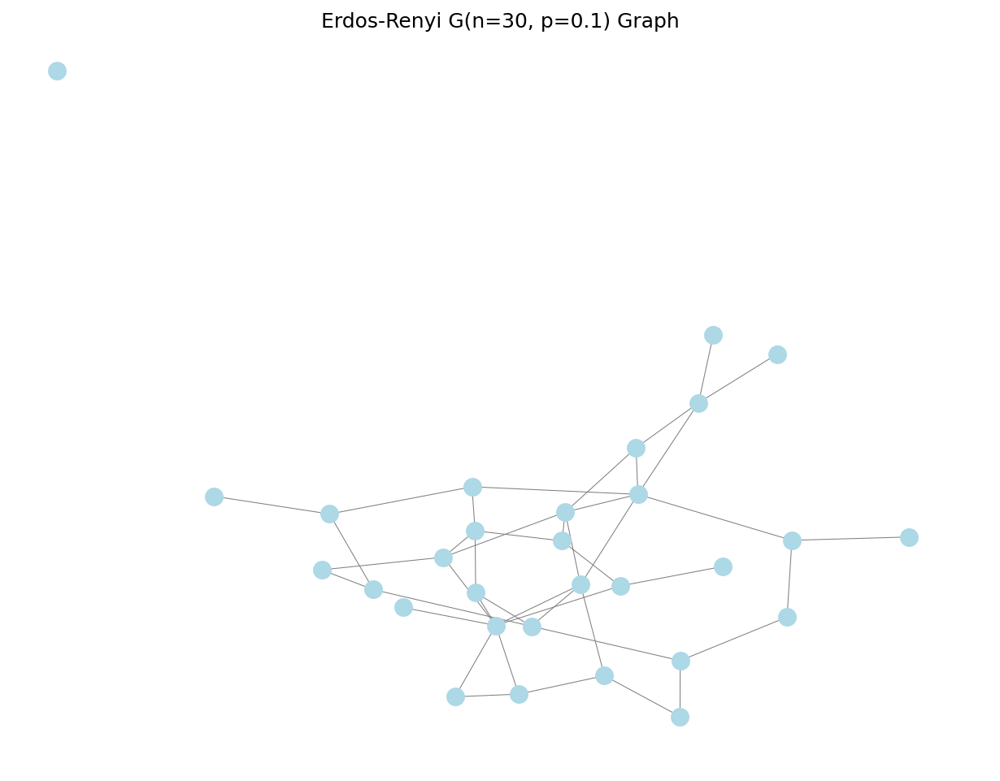
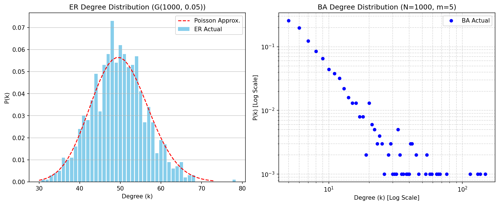
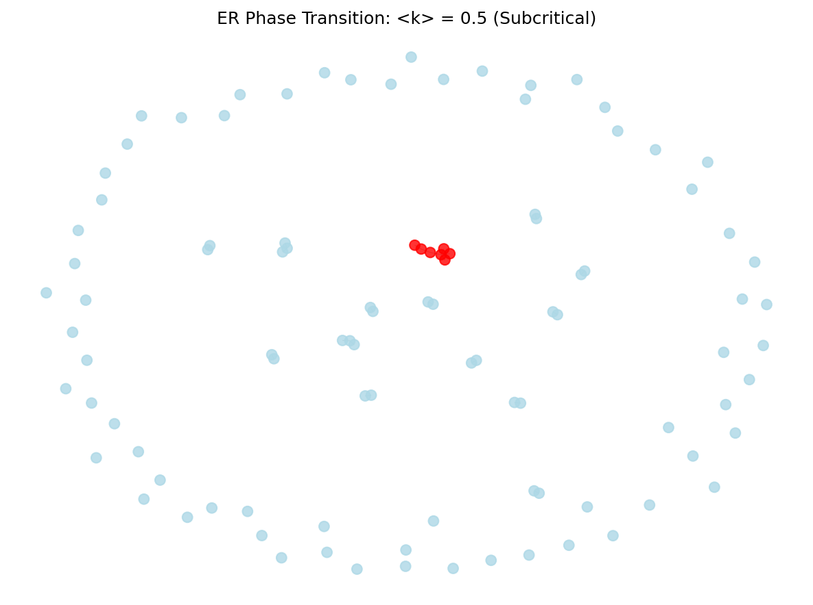
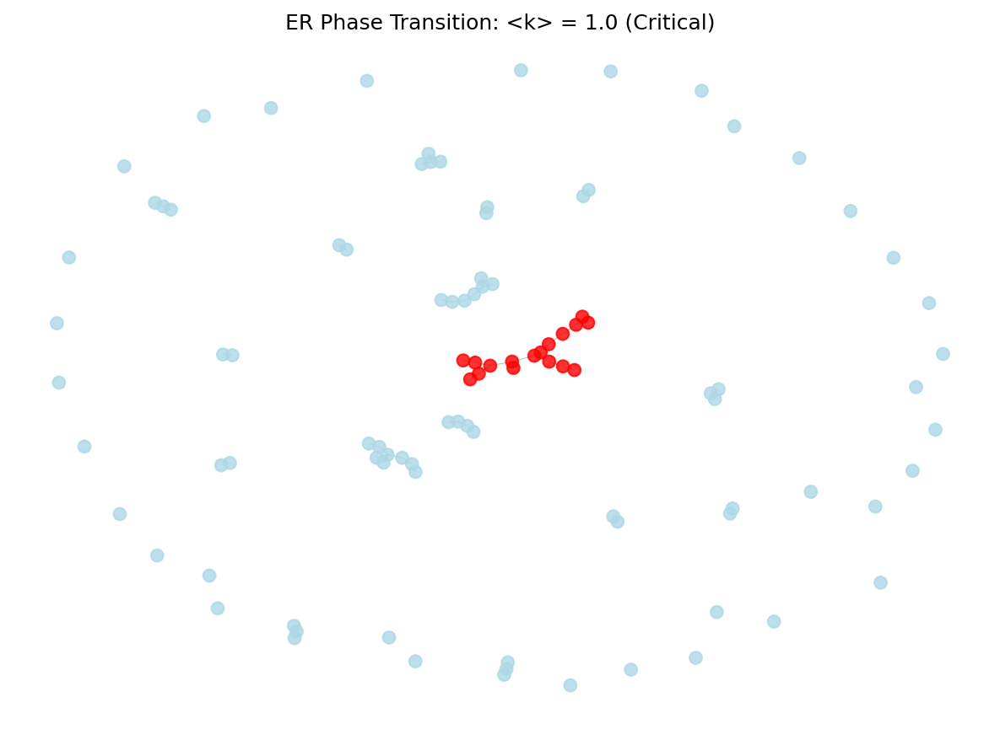
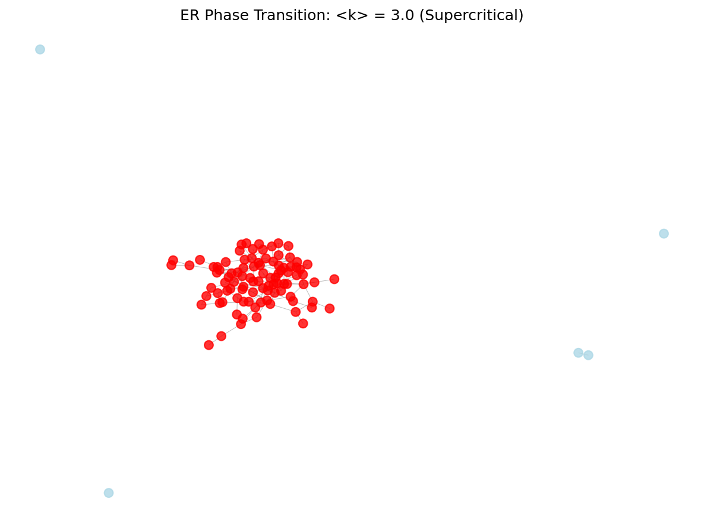
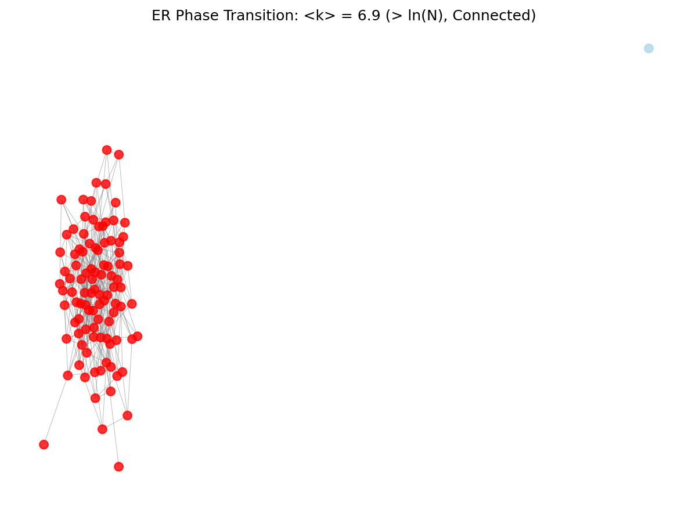
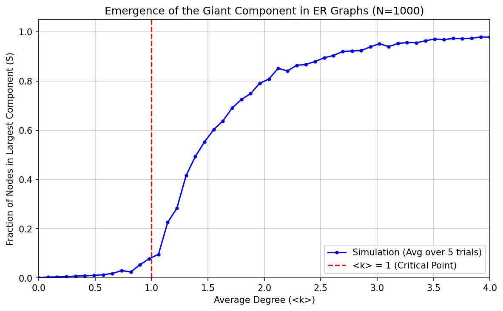

# Random Graph Models
## Understanding Network Structure Through Randomness

Network Analysis - Lecture 6
Nikola Balic, Faculty of Natural Science, University of Split
Data Science and Engineering Master Program

---

## Recap and What's Next

- **Previous Lectures:** Graph fundamentals, measures, connectivity, communities.
- **Today:** Introduction to Network Models - starting with the simplest: Random Graphs.
- **Why Models?**
    - Understand mechanisms driving network formation.
    - Generate synthetic networks for simulation/testing.
    - Provide a baseline (null model) to compare real networks against.

---

## Introduction to Random Graphs

- **Understand Formation:** How do network structures arise? (e.g., social ties, web links)
- **Generate Networks:** Create artificial networks for simulations or testing algorithms.
- **Baseline Comparison:** Use simple models (like random graphs) as a "null hypothesis" to see how real networks differ. Is a real network's property just due to chance, or something more?

---

## The Erdős–Rényi (ER) Model

- **Core Idea:** What if network connections formed *randomly*?
- **Simplest Model:** The **Erdős–Rényi (ER) Random Graph Model**.
- Developed by mathematicians Paul Erdős and Alfréd Rényi.
- Acts as a fundamental starting point.

---

## The Erdős–Rényi (ER) Model: Two Flavors

1.  **G(n, M) Model:**
    - **n:** Start with a fixed number of *nodes* (vertices).
    - **M:** Add a fixed number of *edges* chosen completely *at random* from all possible pairs.
    - Think: You have *n* people and randomly draw *M* pairs to connect.

---

## The Erdős–Rényi (ER) Model: Two Flavors

2.  **G(n, p) Model:**
    - **n:** Start with a fixed number of *nodes*.
    - **p:** For *every single possible pair* of nodes, decide whether to add an edge *independently* with probability *p*.
    - Think: For every pair of people, flip a coin (biased with probability *p*) – heads they connect, tails they don't.
    - The *exact* number of edges isn't fixed beforehand, it varies.

***We'll mostly use the G(n, p) model.***

---

## Generating ER Graphs in NetworkX: G(n, p)

```python
import networkx as nx
import matplotlib.pyplot as plt

# Parameters
n = 30  # Number of nodes
p = 0.1 # Probability of an edge between any pair

# Create the G(n, p) graph
G_np = nx.erdos_renyi_graph(n, p)

# Check the result
print(f"Created graph with {G_np.number_of_nodes()} nodes.")
print(f"It has {G_np.number_of_edges()} edges.")
# On average, we expect n*(n-1)/2 * p edges
print(f"Expected edges (average): {n*(n-1)/2 * p:.1f}")
```

---

## Visualizing the G(n, p) Graph

```python
# Visualize the generated graph
plt.figure(figsize=(8, 6))
# Use a layout algorithm to position nodes
pos = nx.spring_layout(G_np, seed=42)
nx.draw(G_np, pos, node_size=100, node_color='lightblue', with_labels=False)
plt.title(f"Erdos-Renyi G({n}, {p}) Graph")
plt.show()
```

---

## Example G(30, 0.1) Graph



---

## Property 1: Degree Distribution

- **Question:** In a G(n, p) graph, how many connections (degree) does a typical node have?
- Consider one specific node, *v*.
- It *could* connect to any of the other *n-1* nodes.
- The connection to each neighbor happens independently with probability *p*
- On average, a node has p(n-1) connections

---

## Degree Distribution: It's Binomial!

- This is a classic probability scenario!
- For a node *v*, the number of neighbors (its degree *k*) follows a **Binomial distribution**.
- Probability of having exactly *k* neighbors:
  $P(k) = \\binom{n-1}{k} p^k (1-p)^{n-1-k}$
  - $\\binom{n-1}{k}$: Ways to choose *k* neighbors out of *n-1*.
  - $p^k$: Probability of connecting to those *k*.
  - $(1-p)^{n-1-k}$: Probability of *not* connecting to the remaining *n-1-k*.

---

## Degree Distribution: Poisson Approximation (for large N)

- When the network is large (*n* is big) and the connection probability *p* is small, but the *average degree* $\langle k \rangle = p(n-1)$ is moderate:
- The Binomial distribution looks very similar to a **Poisson distribution**:
  $P(k) \\approx e^{-\langle k \rangle} \\frac{\langle k \rangle^k}{k!}$
- **What this means:** Most nodes have degrees very close to the average degree $\langle k \rangle$. Nodes with degrees far from the average are rare.

---

## Degree Distribution: ER vs. Real Networks



*Left: Typical ER graph degree distribution (Poisson-like, peaked shape). Most nodes have similar degrees.*
*Right: Typical real network (e.g., social network) degree distribution (Heavy-tailed/Power-law). Many low-degree nodes, few high-degree 'hubs'.*

**Key Difference:** ER graphs lack hubs!

---

## Property 2: Clustering Coefficient

- **Question:** Are the neighbors of a node also connected to each other? (Are my friends also friends?)
- **Local Clustering Coefficient ($C_v$):** For a node *v*, what fraction of its neighbors are connected?
$C_v = \frac{\text{number of edges between neighbors}}{\text{maximum possible edges between neighbors}}$
- In an ER graph, *any* pair of nodes connects with probability *p*.

---

## Clustering in ER Graphs: It's Low!

- If node *v* has neighbors *u* and *w*, the probability they are connected is just *p*.
- So, the expected local clustering coefficient for any node *v* is simply $C_v = p$.
- The **average clustering coefficient** for the whole graph is also $C = p$.
- Since $\langle k \rangle = p(n-1)$, we can write $C = \frac{\langle k \rangle}{n-1}$.

---

## Clustering: ER vs. Real Networks

- **Implication:** For large networks (*n* large) with a fixed average degree $\langle k \rangle$, the clustering coefficient $C = \langle k \rangle / (n-1)$ becomes *very small*.
- **Contrast:** Real social networks often have *high* clustering. If you are friends with Alice and Bob, there's a good chance Alice and Bob are also friends.
- **Conclusion:** The ER model *fails* to capture the high clustering seen in many real-world networks.

---

## Property 3: Average Path Length

- **Question:** On average, how many steps does it take to get from one node to another?
- **Average Shortest Path Length ($\ell$):** The average length of the shortest path between all pairs of nodes in the graph.
- Measures the typical "separation" between nodes.

---

## Path Length in ER Graphs: It's Short! (Small World)

- For a *connected* ER graph, the average path length $\ell$ grows very slowly with network size *n*:
  $\ell \approx \frac{\\ln(n)}{\\ln(\langle k \rangle)}$ (Requires average degree $\langle k \rangle > 1$)
- **Implication:** Even in enormous ER random graphs, you can get from any node to any other node in surprisingly few steps (logarithmic growth).
- **Similarity:** This "small-world" property *is* found in many real networks! Six degrees of separation!

---

## Property 4: The Giant Component & Phase Transition

- What happens to the *overall structure* as we gradually increase the connection probability *p* (or average degree $\langle k \rangle = p(n-1)$)?
- A dramatic change occurs – a **phase transition**.

---

## Phase Transition: Stage 1 (Subcritical)

- **Condition:** Average degree $\langle k \rangle < 1$. (Or $p < 1/(n-1)$)
- **Structure:** The graph is fragmented into many tiny, isolated connected components. Most are simple trees.
- **Largest Component:** The biggest piece is very small, typically size $O(\log n)$.
- **Think:** Very sparse connections, like distant islands.


*Graph is mostly isolated nodes and small groups.*

---

## Phase Transition: Stage 2 (Critical Point)

- **Condition:** Average degree $\langle k \rangle = 1$. (Or $p = 1/(n-1)$)
- **Structure:** Suddenly, larger components start linking up. A "Giant Connected Component" (GCC) begins to emerge.
- **Largest Component:** The GCC size scales as $O(n^{2/3})$. It's growing much faster than before, but still doesn't cover most nodes.
- **Think:** Islands starting to connect via bridges.


*A larger component starts to form, linking previous fragments.*

---

## Phase Transition: Stage 3 (Supercritical)

- **Condition:** Average degree $\langle k \rangle > 1$. (Or $p > 1/(n-1)$)
- **Structure:** The Giant Connected Component (GCC) rapidly grows and dominates the network. It contains a significant fraction *S* of *all* nodes (where *S* > 0, and *S* increases with $\langle k \rangle$).
- **Other Components:** Any nodes *not* in the GCC are still in tiny, isolated components ($O(\log n)$).
- **Think:** One massive continent forms, with a few tiny islands left over.


*One giant component contains most nodes.*

---

## Phase Transition: Stage 4 (Connected Regime)

- **Condition:** Average degree $\langle k \rangle > \ln(n)$. (Or $p > \ln(n)/(n-1)$)
- **Structure:** The GCC engulfs essentially all nodes. The graph becomes fully connected (or has a very high probability of being connected).
- **Think:** All islands have merged into the main continent.


*Essentially all nodes belong to the single giant component.*

---

## Emergence of the Giant Component



*This plot shows the fraction of nodes in the Largest Connected Component (LCC) as the average degree $\langle k \rangle$ increases. Note the sharp transition around $\langle k \rangle = 1$.*

- This sudden emergence of large-scale order (the GCC) from purely random local connections is a fundamental concept.

---

## ER Model vs. Real Networks: Summary Table

| Property              | ER Random Graph G(n, p)                     | Typical Real Network         | Match? |
| :-------------------- | :------------------------------------------ | :--------------------------- | :----: |
| Avg. Path Length    | **Short** (logarithmic in n) $\\ell \approx \frac{\ln n}{\ln \langle k \rangle}$ | **Short** (Small-World)        |  **Yes**   |
| Avg. Clustering Coeff | **Low** $C = p = \frac{\langle k \rangle}{n-1}$           | **High**                         |   **No**   |
| Degree Distribution   | **Poisson** $P(k) \\approx e^{-\langle k \rangle} \frac{\langle k \rangle^k}{k!}$ | **Heavy-tailed** (Power-law)     |   **No**   |
| Giant Component       | **Emerges** at $\langle k \rangle = 1$           | Often present                |  **Yes**   |

---

## Limitations of the ER Model

- **No High Clustering:** Fails to create the "cliques" or dense local groups seen in real networks (like friend groups).
- **No Hubs:** Doesn't produce nodes with extremely high degrees (like popular websites or influential people). The degree distribution is too narrow.
- **Uniform Probability:** Assumes every pair of nodes is equally likely to connect, which is often unrealistic (e.g., geography, common interests influence connections).

---

## Significance of the ER Model

Despite its limitations, the ER model is crucial:

- **The Null Model:** It's the simplest benchmark. If a real network property differs significantly from the ER model, it suggests non-random mechanisms are at play.
- **Mathematical Foundation:** Relatively easy to analyze mathematically, providing insights into network properties.
- **Emergent Phenomena:** Shows how complex global structures (like the GCC) can arise from simple, local, random rules.
- **Starting Point:** Led to the development of more realistic models that address its shortcomings.

---

## Conclusion

- Erdős–Rényi (ER) graphs model networks formed by pure chance.
- They capture the "small-world" property (short paths) of real networks.
- They *fail* to capture high clustering and the presence of hubs.
- Key takeaway: the phase transition showing the emergence of a giant component from random links.