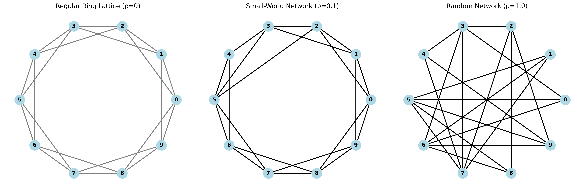
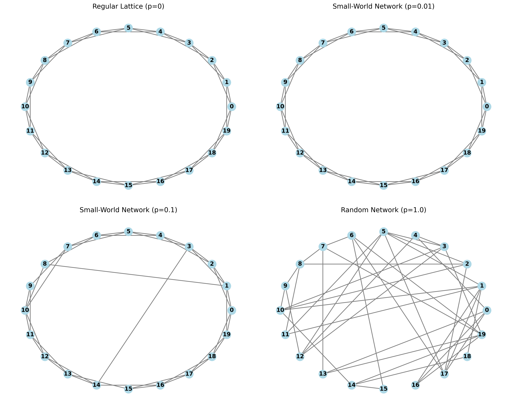
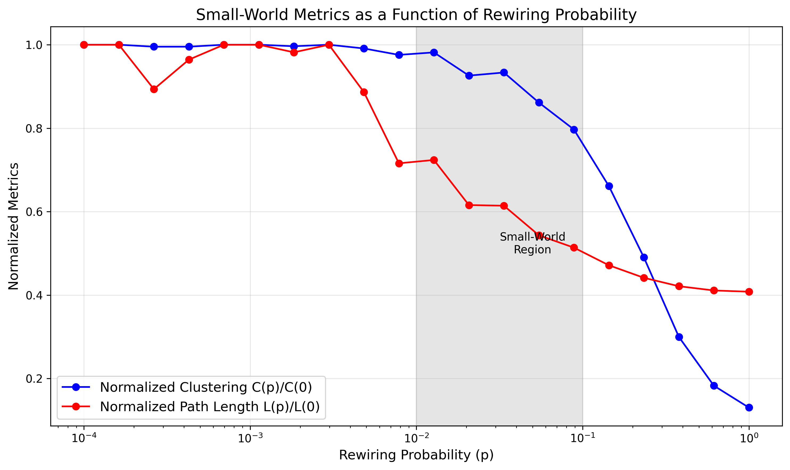
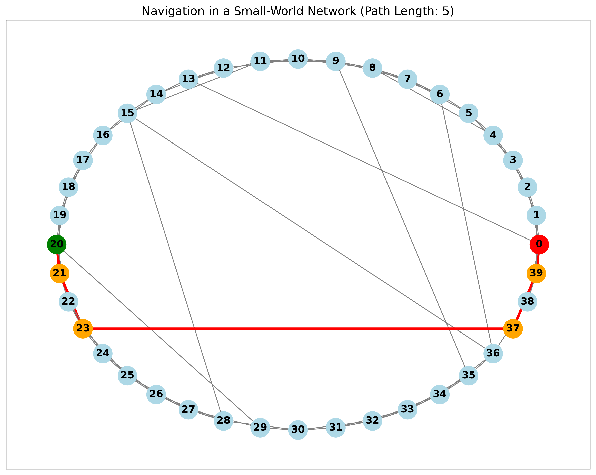

# Small World Networks
## Short Paths in a Clustered World

Network Analysis - Lecture 7
Nikola Balic, Faculty of Natural Science, University of Split
Data Science and Engineering Master Program

23/04/2025

---

## Recap and What's Next

- **Previous Lectures:** Graph fundamentals, measures, connectivity, communities, random graph models.
- **Today:** Small-World Networks - networks that combine high clustering with short path lengths.
- **Key Question:** How can we model networks that have both high clustering and short average path lengths?

---

## The Small-World Phenomenon

- **Six Degrees of Separation:** The idea that any two people are connected by at most six intermediaries.
- First observed by Stanley Milgram in the 1960s:
  - "Small-World Experiment": Random people in the Midwest asked to send letters to a Boston stockbroker.
  - Letters could only be passed to personal acquaintances who might be "closer" to the target.
  - Result: Average path length ~6 steps, despite participants having only local knowledge.

---

## The Small-World Puzzle

In many real-world networks:
- **High Clustering:** Local groups are densely connected (like in regular lattices).
- **Short Paths:** Average distance between any two nodes is surprisingly small (like in random networks).

This combination is NOT explained by the ER Random Graph model!

---

## Watts-Strogatz Small-World Model

Introduced by Duncan Watts and Steven Strogatz in 1998 to resolve this puzzle.

The key insight: Just a few random "shortcuts" drastically reduce path lengths while maintaining clustering.

---

## Watts-Strogatz Model: Construction

1. **Start with a Regular Ring Lattice:**
   - n nodes, each connected to k nearest neighbors
   - High clustering, long path lengths

2. **Rewiring Process:**
   - For each edge, with probability p, rewire one end to a random node
   - Creates "shortcuts" across the network

3. **Result:**
   - Small-world network that blends order and randomness

---

## Watts-Strogatz: Rewiring Visualization



- **p = 0:** Regular ring lattice (high clustering, long paths)
- **0 < p < 1:** Small-world network (high clustering, short paths)
- **p = 1:** Random network (low clustering, short paths)

---

## Implementing Watts-Strogatz in NetworkX

```python
import networkx as nx
import matplotlib.pyplot as plt

# Parameters
n = 20  # Number of nodes
k = 4   # Each node connected to k nearest neighbors
p = 0.1 # Probability of rewiring each edge

# Generate small-world network
G = nx.watts_strogatz_graph(n, k, p)

# Visualize
plt.figure(figsize=(8, 8))
nx.draw_circular(G, node_color='lightblue', node_size=500, with_labels=True)
plt.title(f"Watts-Strogatz Small-World Network (n={n}, k={k}, p={p})")
plt.show()
```

---

## Watts-Strogatz: Effect of Rewiring Probability



The transition from regular to small-world to random as p increases

---

## Key Metrics in Small-World Networks

The small-world property is quantified through:

1. **Clustering Coefficient (C):** Measures transitivity of connections
   - "Are my friends also friends with each other?"
   - High in regular networks, low in random networks

2. **Average Shortest Path Length (L):** Average distance between node pairs
   - Low value means information travels quickly
   - High in regular networks, low in random networks

---

## Measuring Small-World-ness

As rewiring probability p increases:



- **Path Length L(p)** drops quickly with small p
- **Clustering C(p)** decreases slowly initially
- **Sweet spot:** Small p where paths are short but clustering remains high

---

## Code to Analyze Small-World Properties

```python
# Calculate metrics
avg_shortest_path = nx.average_shortest_path_length(G)
avg_clustering = nx.average_clustering(G)

print(f"Small-World Network Metrics:")
print(f"Average Shortest Path Length: {avg_shortest_path:.4f}")
print(f"Average Clustering Coefficient: {avg_clustering:.4f}")

# Compare with equivalent random graph
random_G = nx.erdos_renyi_graph(n, p=k/(n-1))
random_path = nx.average_shortest_path_length(random_G)
random_clustering = nx.average_clustering(random_G)

print(f"\nEquivalent Random Graph Metrics:")
print(f"Average Shortest Path Length: {random_path:.4f}")
print(f"Average Clustering Coefficient: {random_clustering:.4f}")
```

---

## Navigation in Small-World Networks

- In purely random networks, finding short paths is easy but requires global knowledge.
- In small-world networks, individuals with only local knowledge can still find short paths:
  - "Greedy routing" - passing message to neighbor closest to target - works efficiently.
  - Explains how Milgram's experiment participants found short chains.

---

## Real-World Small-World Networks

- **Social Networks:** Friendship and collaboration networks
- **Neural Networks:** Connections in the brain
- **Power Grids:** Electrical transmission networks
- **Transportation Networks:** Airline routes
- **Internet and WWW:** Web pages and hyperlinks
- **Gene Regulatory Networks:** Gene interactions

---

## Small-World Navigation Example

Routing strategies in small-world networks:



- Local connections provide structural context
- Shortcuts dramatically reduce distance
- Combination allows efficient navigation with limited knowledge

---

## Small-World vs. Random vs. Regular Networks

| Property | Regular Network | Small-World Network | Random Network |
|:--------:|:---------------:|:-------------------:|:--------------:|
| Clustering | **High** | **High** | Low |
| Path Length | Long | **Short** | **Short** |
| Degree Distribution | Uniform | Peaked near average | Poisson |
| Navigation with Local Knowledge | Poor | **Good** | Poor |

Small-world networks combine the best properties of both random and regular networks.

---

## Small-World and the Internet

The Internet is a prime example of a small-world network:

- **High clustering:** Local/regional connections are dense
- **Short paths:** Very few hops between any two points globally
- **Strategic "long-range" connections:** Intercontinental cables, major exchanges
- **Efficient navigation:** Packets can find efficient routes through complex topology

---

## Applications of Small-World Network Analysis

- **Disease Spreading:** Predicting epidemic dynamics
- **Information Diffusion:** How news and ideas propagate
- **Network Vulnerability:** Identifying critical nodes/edges
- **Designing Efficient Networks:** Transit systems, power grids
- **Neural Networks:** Understanding brain connectivity
- **Collaborative Systems:** Designing organizational structures

---

## Beyond Watts-Strogatz

- **Newman-Watts Model:** Adds shortcuts instead of rewiring (no disconnected components)
- **Kleinberg Model:** Distance-dependent probability of long-range connections (optimal navigability)
- **Hierarchical Small-World Models:** Captures multilevel organization in real networks
- **Geographical Small-World Models:** Incorporates spatial constraints

---

## Mathematical Properties

For small p, Watts-Strogatz networks show:

- **Clustering:** $C(p) \approx C(0)(1-3p)$ (declines linearly with p)
- **Path Length:** $L(p) \approx \frac{L(0)}{2\sqrt{p}}$ when p is small (drops quickly with p)
- **Critical Value:** "Small-world-ness" emerges around p ≈ 1/n

These explain why only a few shortcuts are needed for the small-world effect.

---

## Exploring Small-World Networks: Code Example

```python
# Explore small-world properties with varying p
import numpy as np

# Calculate metrics across different rewiring probabilities
probs = np.logspace(-4, 0, 10)  # from 0.0001 to 1.0
clustering_values = []
path_length_values = []

for prob in probs:
    G = nx.watts_strogatz_graph(n=100, k=10, p=prob)
    clustering_values.append(nx.average_clustering(G))
    path_length_values.append(nx.average_shortest_path_length(G))

# Normalized values (relative to p=0)
norm_clustering = [c/clustering_values[0] for c in clustering_values]
norm_path_length = [l/path_length_values[0] for l in path_length_values]
```

---

## Key Takeaways

1. Small-world networks combine **high clustering** with **short path lengths**.
2. The Watts-Strogatz model creates small-world networks through controlled rewiring.
3. Just a **few random shortcuts** dramatically reduce path lengths.
4. Small-world properties help explain efficient **information diffusion** and **navigation**.
5. Many real-world networks exhibit small-world properties.

---

## Next Lecture: Scale-Free Networks

We'll explore another important network model:
- Networks with power-law degree distributions
- The Barabási-Albert model and preferential attachment
- How hubs form in real-world networks
- Properties and implications of scale-free structure