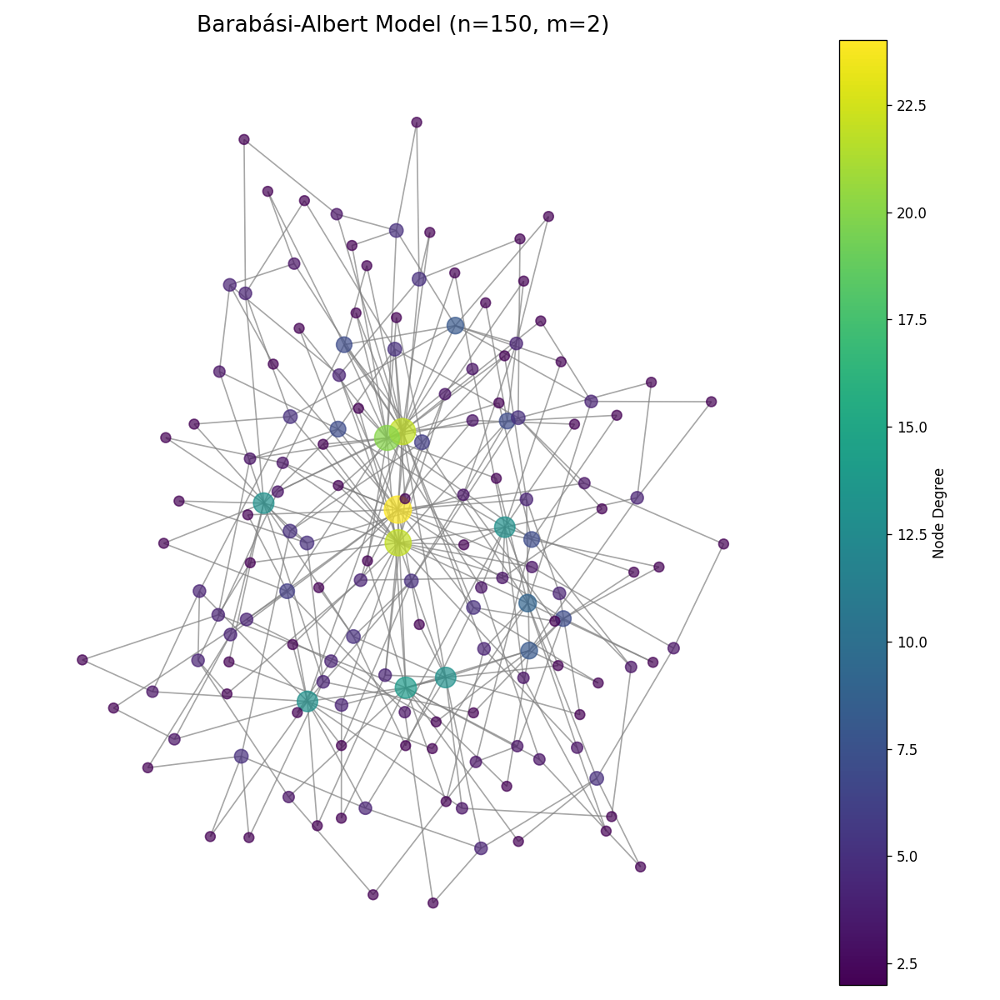

# Scale-Free Networks
## Power Laws and Preferential Attachment

Network Analysis - Lecture 8
Nikola Balic, Faculty of Natural Science, University of Split
Data Science and Engineering Master Program

30/04/2025

---

## Recap and What's Next

- **Previous Lectures:** Graph fundamentals, measures, connectivity, communities, random graphs, small-world networks.
- **Today:** Scale-Free Networks - networks with a power-law degree distribution.
- **Key Question:** How do networks with highly connected hubs form, and what are their properties?

---

## Introduction to Scale-Free Networks

Scale-free networks are characterized by:
- **Power-law degree distribution:** P(k) ~ k^(-α), where α typically ranges between 2 and 3
- **Presence of hubs:** Few nodes have extremely high connectivity
- **No characteristic scale:** No "typical" node in the network (hence "scale-free")

These properties are observed in many real-world networks!

---

## Power-Law Degree Distribution

Unlike random networks (Poisson distribution) or small-world networks (peaked near average)


---

## Scale-Free Property: Linear View

The degree distribution of scale-free networks shows a characteristic pattern:


- **Most nodes have few connections**: The majority are low-degree nodes
- **Very few nodes have many connections**: A small number of "hubs" with high connectivity
- **No characteristic scale**: The degree distribution spans orders of magnitude

---

## Understanding Power Laws

Power-law distribution:

$$P(k) \sim k^{-\alpha}$$

- **Mathematical properties:**
  - The probability of finding a node with degree k decreases as
- $$k^{-\alpha}$$
  - Heavy-tailed distribution: Small probability of extremely high values
  - Scale invariance: The shape looks the same at different scales


---

## The Barabási-Albert Model

Introduced by Albert-László Barabási and Réka Albert in 1999.

Two key mechanisms:
1. **Growth:** Network continuously expands by adding new nodes
2. **Preferential Attachment:** New nodes connect preferentially to already well-connected nodes

> "The rich get richer" or "Matthew effect"


---

## Preferential Attachment: Algorithm

1. Start with a small initial network of m₀ nodes
2. Add new nodes one at a time
3. Each new node connects to m existing nodes
4. Probability of connecting to node i is proportional to its degree:

   $$P(i) = \frac{k_i}{\sum_j k_j}$$

5. Repeat until desired network size is reached

---

## Preferential Attachment: Visual Example


---

## Implementing Barabási-Albert in NetworkX

```python
import networkx as nx
import matplotlib.pyplot as plt

# Parameters
n = 1000  # Number of nodes
m = 2     # Number of edges to attach from a new node

# Generate scale-free network
G = nx.barabasi_albert_graph(n, m)

# Calculate degree distribution
degrees = [d for _, d in G.degree()]
plt.hist(degrees, bins=30, log=True)
plt.xlabel('Degree')
plt.ylabel('Count (log scale)')
plt.title('Degree Distribution of BA Network')
plt.show()
```

---

## Barabási-Albert Networks: Effect of Parameter m


As m increases:
- Network becomes more densely connected
- Power-law exponent decreases
- Hubs become less pronounced relative to other nodes

---

## Visualizing a Scale-Free Network



Note the presence of highly connected hubs (brighter colors)

---

## Mathematical Properties of BA Networks

For the Barabási-Albert model:

- **Degree distribution:**
  $$P(k) \sim k^{-3}$$
- **Average path length:**
  $$L \sim \frac{\ln(N)}{\ln(\ln(N))}$$
- **Clustering coefficient:**
  $$C \sim N^{-0.75}$$

Unlike small-world networks, clustering is lower but still higher than random networks.

---

## Emergence of Hubs

Hubs are nodes with exceptionally high degree that emerge naturally in scale-free networks.


Hubs play critical roles:
- Drastically reduce network diameter
- Facilitate efficient information flow
- Create vulnerability to targeted attacks

---

## Network Resilience in Scale-Free Networks

Scale-free networks exhibit:
- **High resilience to random failures**
- **High vulnerability to targeted attacks**


---

## The "Achilles' Heel" of Scale-Free Networks

- Random failures typically affect low-degree nodes → minimal impact
- Targeted attacks on hubs → catastrophic network fragmentation

**Real-world implications:**
- Internet resilience to random server failures
- Vulnerability of power grids to targeted attacks
- Spread of diseases in social networks

---

## Generating Scale-Free Networks: Alternatives

- **Configuration Model:** Generate networks with any desired degree distribution
- **Fitness Model:** Nodes have intrinsic fitness affecting attachment probability
- **Non-linear Preferential Attachment:** Attachment probability $$\sim k^{\beta}$$ ($$\beta \neq 1$$)
- **Aging Effects:** Older nodes become less attractive for attachment
- **Geographical Constraints:** Spatial limitations on connections

---

## Real-World Scale-Free Networks


---

## Examples in Various Domains

- **Internet:** Routers and connections
- **World Wide Web:** Websites and hyperlinks
- **Social Networks:** Twitter followers, scientific collaborations
- **Biological Networks:** Protein interactions, metabolic networks
- **Transportation:** Airline routes
- **Citation Networks:** Scientific papers and citations
- **Economic Networks:** Trade relationships, financial transactions

---


---

## Limitations of Pure Scale-Free Models

Real networks often deviate from perfect power laws:
- **Finite-size effects:** Real networks have limited size
- **Growth constraints:** Physical, technological, or resource limitations
- **Aging and death of nodes:** Nodes may become inactive or be removed
- **Costs of adding links:** Physical or maintenance costs limit connections
- **Directed and weighted connections:** More complex than simple undirected links

---

## Detecting Scale-Free Properties

How to determine if a network is scale-free:
1. Plot degree distribution on log-log scale
2. Fit power-law using maximum likelihood estimation
3. Calculate goodness-of-fit (Kolmogorov-Smirnov test)
4. Compare with alternative distributions (exponential, log-normal)

```python
import powerlaw
# Fit power law to degree distribution
fit = powerlaw.Fit(degrees)
print(f"Power law exponent: {fit.alpha}")
# Compare with alternative distributions
R, p = fit.distribution_compare('power_law', 'exponential')
```

---

## Controversies and Debates

- **Are most "scale-free" networks truly scale-free?**
  - 2018 paper by Broido & Clauset questioned prevalence
  - Different definitions and detection methods yield different results

- **Alternative models:**
  - Log-normal distributions
  - Stretched exponentials
  - Truncated power laws

→ Active area of research!

---

## Applications of Scale-Free Network Analysis

- **Network Robustness:** Designing resilient infrastructure
- **Epidemic Spreading:** Modeling disease transmission
- **Targeted Interventions:** Identifying critical nodes
- **Search Algorithms:** Finding information efficiently
- **Recommendation Systems:** Leveraging network structure
- **Marketing Strategies:** Identifying influential nodes

---

## Python Tools for Scale-Free Network Analysis

```python
# Fitting and testing power-law distributions
import powerlaw
fit = powerlaw.Fit(degrees)
print(f"Alpha: {fit.alpha}, xmin: {fit.xmin}")
print(f"Goodness of fit: {fit.power_law.KS()}")

# Testing against alternative distributions
R, p = fit.distribution_compare('power_law', 'exponential')
print(f"Log-likelihood ratio: {R}, p-value: {p}")

# Creating scale-free networks with NetworkX
G = nx.barabasi_albert_graph(n=1000, m=2)
G = nx.powerlaw_cluster_graph(n=1000, m=2, p=0.1)
```

---

## Key Takeaways

1. Scale-free networks have a **power-law degree distribution** with P(k) ~ k^(-α)
2. They form through **growth** and **preferential attachment**
3. They contain **hubs** that connect many other nodes
4. They are **robust against random failures** but **vulnerable to targeted attacks**
5. Many **real-world networks** exhibit scale-free properties
6. Understanding scale-free structure helps design **more resilient systems**

---

## Next Lecture: Network Resilience

We'll expand on network robustness and resilience:
- Quantifying network resilience
- Cascading failures and percolation theory
- Design principles for resilient networks
- Case studies of network failures
- Strategies for improving network robustness