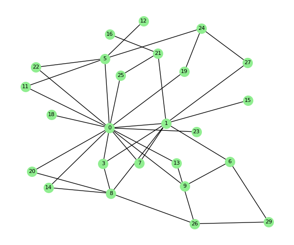
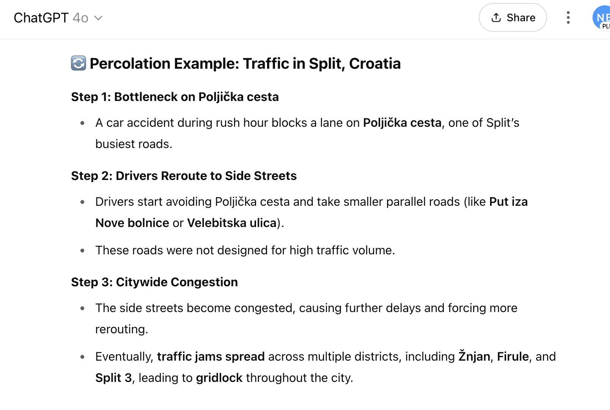

# Network Resilience
## Robustness, Vulnerability, and Cascading Failures

Network Analysis - Lecture 9
Nikola Balic, Faculty of Natural Science, University of Split
Data Science and Engineering Master Program

---

## Recap and Today's Focus

- **Previous Lectures:** Graph fundamentals, measures, connectivity (L04), communities, and various network models (ER, WS, BA - L06, L07, L08).
- **Lecture 04 & 08 touched on:** Articulation points, bridges, and scale-free network vulnerability.
- **Today:** A dedicated look at **Network Resilience**.
    - How do networks respond to failures or attacks?
    - Which network structures are more robust?
    - How do failures spread?

---

## What is Network Resilience?

**Network Resilience** refers to a network's ability to:
1.  Withstand disruptions (node or edge failures/removals).
2.  Maintain its fundamental structure and function despite these disruptions.
3.  Recover from damage.

Key aspects:
- **Robustness:** Ability to maintain function when a part of the system fails.
- **Vulnerability:** Susceptibility to disruptions that lead to significant degradation of performance.

---

## Types of Disruptions 1/3

1.  **Random Failures:**
    - Nodes or edges are removed randomly (e.g., accidental hardware malfunction, random errors).
    - No specific targeting.

---

## Types of Disruptions 2/3

2.  **Targeted Attacks:**
    - Nodes or edges are removed strategically.
    - Examples:
        - Removing nodes with the highest degree (hubs).
        - Removing nodes with highest betweenness centrality (critical bridges).
        - Removing most "important" edges.

---

## Types of Disruptions 3/3

3.  **Cascading Failures:**
    - The failure of one or more components triggers a sequence of subsequent failures in other components.
    - Common in interdependent systems (e.g., power grids, financial networks).

---

## Measuring Resilience

How do we quantify if a network is resilient?

- **Size of the Giant Connected Component (GCC):**
    - How does the largest connected part of the network shrink as nodes/edges are removed?
    - A sharp drop indicates vulnerability.
- **Average Path Length / Diameter:**
    - Do distances between remaining nodes increase significantly?
    - Affects communication efficiency.

---

## Measuring Resilience

- **Network Efficiency:**
    - A measure combining path lengths; how efficiently information can be exchanged.
- **Number of Isolated Components:**
    - Does the network fragment into many small pieces?

---

## Resilience of Different Network Models

Let's compare how ER, WS, and BA models respond to random vs. targeted attacks.
(N=200 nodes in these simulations)


*Relative GCC size vs. fraction of nodes removed.*

---

### Resilience of Erdős–Rényi (ER) Graphs

- **Random Failures:** Relatively robust. Since degrees are homogeneous (Poisson distribution), removing a random node is similar to removing any other. The GCC degrades gracefully.
- **Targeted Attacks:** Not significantly more vulnerable than random attacks, as there are no distinct "hubs" to target. Performance is similar to random failures.

---

### Resilience of Watts-Strogatz (WS) Small-World Graphs

- **Random Failures:**
    - If local connections fail, clustering is affected but path length might not change drastically if shortcuts remain.
    - If shortcuts fail, path length increases, moving towards a regular lattice.
    - Generally, fairly robust to random failures.
- **Targeted Attacks:**
    - Targeting nodes that act as shortcuts can quickly increase path length.
    - Targeting highly clustered nodes can fragment local communities.
    - More vulnerable than ER to targeted attacks that disrupt shortcuts.

---

### Resilience of Barabási-Albert (BA) Scale-Free Graphs

- **Random Failures: (Highly Robust)**
    - Most nodes have low degrees. Random removal likely hits these non-critical nodes.
    - Hubs are few, so unlikely to be hit randomly until many nodes are gone.
    - GCC size degrades very slowly.
- **Targeted Attacks: (Highly Vulnerable - "Achilles' Heel")**
    - Removing a few high-degree hubs can quickly dismantle the network.
    - The GCC can collapse rapidly.
    - This is because hubs are essential for keeping the network connected.

---

## Visualizing Network Fragmentation

Example: Barabási-Albert Network (N=30, m=2)

| Initial State | 5 Random Removals | 3 Hub Removals |
| :------------------------------------: | :---------------------------------------: | :----------------------------------------: |
|  |  |  |
| Network largely intact. | Minor impact, still connected. | Network significantly fragmented. |

Targeting hubs in scale-free networks causes much more damage.

---

## What is Percolation? (Intuitive Introduction)

Imagine liquid seeping through coffee grounds.

In networks, percolation means asking: if we randomly remove nodes or edges, does a large connected cluster still exist, or does the network break?

- **Everyday analogy:** Think of trying to walk across stepping stones in a river. If enough stones are missing, you can't cross!
- **In networks:** As more nodes/edges are removed, at some point, the network loses its large-scale connectivity.
- **Key question:** How much can be removed before the network "falls apart"?


---

## Percolation Theory

A mathematical framework to study the connectivity of random systems.

- **Site Percolation:** Nodes are "occupied" (present) with probability *p* or "empty" (removed) with probability *1-p*.
- **Bond Percolation:** Edges are "open" (present) with probability *p* or "closed" (removed) with probability *1-p*.

**Percolation Threshold ($p_c$):**
- A critical probability.
- If $p > p_c$, a giant connected component (spanning the network) exists.
- If $p < p_c$, the network consists of small, finite clusters.
- This is related to the phase transition seen in ER graphs.

---

## Percolation Threshold in ER Graphs


*Relative GCC size (S) vs. Average Degree <k> for an ER graph. The critical threshold for GCC emergence is at <k>=1 (which corresponds to $p_c \approx 1/N$ for edge occupation probability).*

---

## Cascading Failures

Initial failures can trigger a cascade of subsequent failures.
- **Mechanism:** Often due to load redistribution. When a component fails, its load is transferred to neighbors. If neighbors exceed their capacity, they also fail, and so on.
- **Examples:**
    - Power grid blackouts (e.g., 2025 Iberian Peninsula).
    - Financial crises (e.g. 2008 Lehman Brothers).
    - Traffic jams spreading through a road network.

---



---

## Conceptual Example of Cascading Failure


1.  **Initial State:** Node D is critical, handling significant load.
2.  **D Fails:** Load from D is redistributed (e.g., to A).
3.  **A Overloaded:** Node A now exceeds its capacity due to the extra load and fails, potentially triggering further failures.

Modeling cascading failures often involves defining node capacities and load distribution rules.

---

## Strategies to Enhance Network Resilience 1/2

1.  **Redundancy:**
    - Add alternative paths and duplicate critical components.
    - E.g., multiple fiber optic cables, backup servers.
2.  **Decentralization:**
    - Reduce reliance on a few central hubs.
    - Distribute critical functions across more nodes.
3.  **Protecting Critical Components:**
    - Identify and strengthen articulation points, bridges, and hubs.
    - E.g., physical protection, increased capacity.

---

## Strategies to Enhance Network Resilience 2/2

4.  **Modularity:**
    - Design networks with well-defined communities.
    - Can help contain failures within a module, preventing widespread cascades.
5.  **Adaptive Rewiring/Healing:**
    - Mechanisms for the network to reconfigure itself after damage.
    - E.g., dynamic routing in communication networks.
6.  **Controlling Load Distribution:**
    - Design systems where load redistribution after a failure doesn't immediately overload other components.

---

## Analyzing Resilience with NetworkX

```python
import networkx as nx
import random
import matplotlib.pyplot as plt

G = nx.barabasi_albert_graph(100, 2)
n_initial = G.number_of_nodes()
gcc_sizes = []

nodes_to_remove = list(G.nodes())
random.shuffle(nodes_to_remove)

for i in range(n_initial):
    if G.number_of_nodes() > 0:
        components = list(nx.connected_components(G))
        if components:
            gcc_size = len(max(components, key=len))
            gcc_sizes.append(gcc_size / n_initial)
        else:
            gcc_sizes.append(0)

        G.remove_node(nodes_to_remove[i]) # Remove one node at a time
    else:
        gcc_sizes.append(0)
# Plot gcc_sizes vs. fraction_removed
```

---


---

## Real-World Applications & Importance

- **Internet & Communication Networks:** Designing robust routing protocols, mitigating **DDoS** attacks.
- **Power Grids:** Preventing large-scale blackouts.
- **Transportation Networks:** Ensuring connectivity despite road/rail closures.
- **Supply Chains:** Minimizing disruptions from supplier failures.
- **Ecological Networks:** Understanding ecosystem stability against species extinction.
- **Financial Systems:** Preventing systemic risk and contagion.
- **Epidemiology:** Designing effective vaccination strategies to break disease transmission paths.

---

## Key Takeaways

- Network resilience is crucial for the stable functioning of complex systems.
- Different network structures (ER, WS, BA) exhibit varied resilience profiles.
    - Scale-free networks are robust to random failures but vulnerable to targeted attacks on hubs.
- Percolation theory provides a framework for understanding network collapse.
- Cascading failures can lead to disproportionately large disruptions from initial small failures.
- Strategies like redundancy, decentralization, and modularity can enhance resilience.
